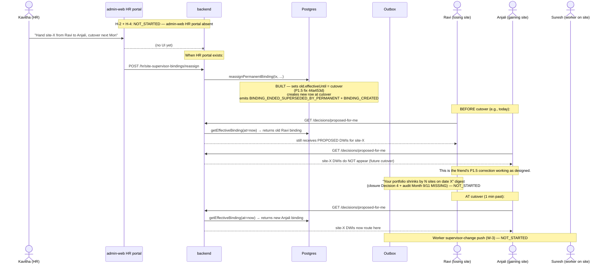
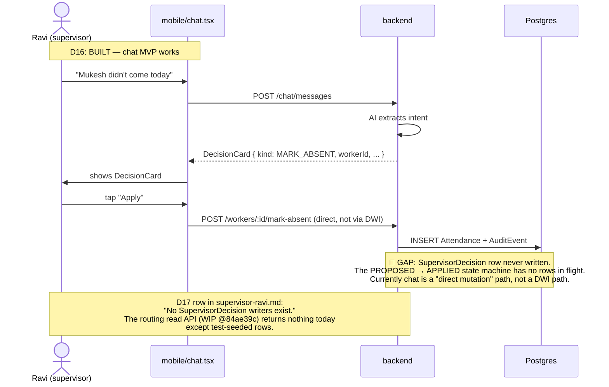

# Execution State — Combined / End-to-End Coherence

**Why this file exists.** Reading any single persona file is not enough. You can have a backend that's `BUILT` from one persona's seat but the workflow still fails end-to-end because a different persona has `NOT_STARTED`. This file answers: **does Supervisor / Worker / HR / Owner line up together?**

**Required reading.** Read this file at the end of the session-start checklist, AFTER reading INDEX.md and the persona file(s) the slice touches.

## Combined workflow summary table

For each workflow: roll-up state derived from the per-persona files. Definitions:

- `END_TO_END` — every persona that touches this workflow has a usable surface for it today.
- `BACKEND_READY` — backend can serve the workflow; one or more persona surfaces is missing.
- `SURFACES_PARTIAL` — some surfaces exist (e.g., supervisor mobile) but others are stubbed or absent.
- `BLOCKED_BY_DESIGN` — workflow design itself is incomplete or `MISSING` in audit.
- `BLOCKED_BY_POLICY` — founder pick or policy decision pending.
- `NOT_STARTED` — no meaningful capacity built.

| ID  | Workflow                            | Roll-up                                                          | Blocked by                                                       |
| --- | ----------------------------------- | ---------------------------------------------------------------- | ---------------------------------------------------------------- |
| A1  | OTP login                           | SURFACES_PARTIAL                                                 | Worker app missing                                               |
| A2  | JWT refresh + role                  | END_TO_END (implicit)                                            | —                                                                |
| A3  | Worker invitation → activation      | BACKEND_READY                                                    | HR portal + worker app                                           |
| A4  | Doc collection → ACTIVE             | BACKEND_READY                                                    | HR review UI + worker app                                        |
| B5  | Site creation                       | BACKEND_READY                                                    | HR portal                                                        |
| B6  | Site state transitions              | BLOCKED_BY_DESIGN                                                | State machine wiring + HR surface                                |
| B7  | Calendar entry creation             | BACKEND_READY                                                    | Supervisor mobile UI                                             |
| B8  | Calendar → Assignment promotion     | BACKEND_READY                                                    | Supervisor mobile UI                                             |
| B9  | Direct assignment                   | BACKEND_READY                                                    | Supervisor + worker surfaces                                     |
| B10 | Conflict detection at assignment    | END_TO_END (server-enforced)                                     | —                                                                |
| C11 | Mark worker absent                  | BACKEND_READY                                                    | Supervisor button + worker subject UI                            |
| C12 | Visit lifecycle                     | BLOCKED_BY_DESIGN                                                | SCHEDULED→IN_PROGRESS trigger + worker app                       |
| C13 | Site complaint logging              | BACKEND_READY                                                    | Supervisor mobile + chat extractor                               |
| C14 | Visit photo verification            | BACKEND_READY                                                    | AI dispatcher (Phase C) + supervisor surface + worker visibility |
| C15 | Audit reversal (30-min undo)        | BLOCKED_BY_POLICY                                                | F-P-4 founder pick                                               |
| D16 | AI chat → decision extraction       | END_TO_END (supervisor side) — but writes go direct, not via DWI | —                                                                |
| D17 | Decision apply (PROPOSED → APPLIED) | NOT_STARTED                                                      | DWI writer missing + read API is WIP                             |
| D18 | Decision dismiss / undo             | NOT_STARTED                                                      | After D17                                                        |
| D19 | Option-picker decision              | NOT_STARTED                                                      | After D17                                                        |
| D20 | EMPLOYMENT-tier ack                 | BACKEND_READY                                                    | HR ack screen + worker subject UI                                |
| E21 | Leave request workflow              | BACKEND_READY                                                    | Worker app + HR queue UI + SLA wiring                            |
| E22 | Worker swap request                 | BLOCKED_BY_DESIGN                                                | Bilateral acceptance design + worker app                         |
| E23 | HR Update post                      | BACKEND_READY                                                    | HR portal composer + supervisor + worker feeds                   |
| E24 | Worker termination                  | BACKEND_READY (kind not chosen)                                  | Kind name + HR ack + worker subject UI + appeal                  |
| E25 | Worker suspension / block           | BLOCKED_BY_DESIGN                                                | Suspension lifecycle design                                      |
| F26 | Acting supervisor coverage          | BACKEND_READY (P1.5)                                             | HR write + supervisor digest + worker notification               |
| F27 | Permanent portfolio reassignment    | BACKEND_READY (P1.5)                                             | HR write + supervisor delta digest + worker notification         |
| F28 | Replacement invite                  | NOT_STARTED                                                      | Backend route + supervisor mobile + worker app                   |
| G29 | AI budget alerts + cron reset       | BACKEND_READY                                                    | Outbox dispatcher (WhatsApp/SMS)                                 |

**Tally as of 2026-05-15:**

- END_TO_END: 3 (A2, B10, D16 with caveat)
- BACKEND_READY: 17
- SURFACES_PARTIAL: 1
- BLOCKED_BY_DESIGN: 4
- BLOCKED_BY_POLICY: 1
- NOT_STARTED: 4

Most workflows are **BACKEND_READY** — schema + routes exist. The single biggest gap is the absence of three surfaces: worker mobile app (0 of 12 worker-touched workflows), admin-web HR portal (0 of 9 HR-touched workflows), and the supervisor-mobile Today / Summary / Updates tabs (3 stub screens that need to become 3 real ones).

## Cross-persona Mermaid sequence diagrams

### F26 — Acting supervisor coverage (end-to-end)

```mermaid
sequenceDiagram
    actor Kavitha as Kavitha (HR)
    participant Admin as admin-web HR portal
    participant Backend as backend
    participant DB as Postgres
    participant Outbox as Outbox / dispatcher
    actor Lakshmi as Lakshmi (acting)
    actor Ravi as Ravi (covered)
    actor Suresh as Suresh (worker)

    Note over Admin: H-1: NOT_STARTED — admin-web HR portal does not exist
    Kavitha->>Admin: "Bind acting Lakshmi → Ravi's sites for 7d"
    Admin--xBackend: (no UI — flow stops here today)

    Note over Backend,DB: When HR portal exists:
    Admin->>Backend: POST /hr/site-supervisor-bindings
    Backend->>DB: INSERT acting binding (P1.5 schema BUILT)
    Backend->>DB: emit BINDING_CREATED (helper BUILT)
    Backend->>Outbox: enqueue worker_supervisor_change_notification
    Backend->>Outbox: enqueue acting_supervisor_window_start
    Note over Outbox,Lakshmi: Lakshmi push: NOT_STARTED (no mobile route yet?<br/>actually supervisor-mobile has the screens; push wiring TBD)
    Note over Outbox,Ravi: Ravi push: NOT_STARTED (closure Decision 4 supervisor-side)
    Note over Outbox,Suresh: Suresh push: NOT_STARTED (worker app absent — W-1)

    Ravi->>Backend: GET /sites/:id/effective-supervisor?at=now
    Backend->>DB: getEffectiveBinding (WIP @84ae39c)
    Backend-->>Ravi: { userId: Lakshmi, kind: ACTING, ... }
    Note over Ravi: Read API works (paused WIP); Ravi UI surface still stub

    Note over Lakshmi,Ravi: Window ends:
    Backend->>Backend: cron binding-expire-sweep — NOT_STARTED
    Backend->>DB: (would emit BINDING_ENDED_AUTO + while-you-were-out digest)
    Note over Outbox: "while you were out" digest — closure Decision 4 — NOT_STARTED
```

**Coherence verdict for F26:** schema + helpers + read API are coherent on backend. **Five surfaces** must land for end-to-end: HR write portal, supervisor "you're now covering" push, supervisor "you're now covered" push, worker supervisor-change push (W-1), and "while you were out" digest at window end. Plus cron `binding-expire-sweep`. Nothing of those surface 5 + cron is built.

### F27 — Permanent portfolio reassignment (end-to-end, future-dated)



**Coherence verdict for F27:** the binding mechanism + future-dated cutover is fully BUILT and verified (18/18 P1.5 tests). The 4 missing surfaces are HR portal, supervisor portfolio-delta digest, supervisor "you now own these new sites" notification, and worker W-3 push. The routing read API (WIP @84ae39c) is the consumer side and almost complete.

### D17 — Decision apply (PROPOSED → APPLIED) — the missing-middle workflow



**Coherence verdict for D17:** the supervisor-side mobile UI works end-to-end for the chat-MVP direct-mutation path. But the spec-mandated PROPOSED → APPLIED lifecycle (with origin attribution, current-responsibility routing, ack gates for EMPLOYMENT tier) is not in code anywhere. This is **the largest single workflow gap in the system today**.

## Overlap-risk section

Cases where two workflows fire simultaneously and the system must hold the no-overlap / precedence invariant.

| Overlap                                           | Status      | Mitigation                                                                                                                                                                         |
| ------------------------------------------------- | ----------- | ---------------------------------------------------------------------------------------------------------------------------------------------------------------------------------- |
| Acting + Permanent on same site                   | BUILT       | EXCLUDE constraint + helper precedence. Tested.                                                                                                                                    |
| Two simultaneous acting windows on same site      | BUILT       | EXCLUDE rejects second insert. Tested.                                                                                                                                             |
| Two permanent bindings overlapping windows        | BUILT       | EXCLUDE rejects. Tested.                                                                                                                                                           |
| Future-dated cutover during active acting         | NOT_STARTED | Schema permits; no test today. Likely safe because acting has its own effectiveUntil and permanent uses effectiveUntil for handoff. Add test in a later slice.                     |
| MARK_ABSENT during sick-supervisor's absence      | NOT_STARTED | Closure §3.2 + Decision 7: originContext + proposedDuringAbsence flag. Schema BUILT. Writer NOT_STARTED. Acting cover should receive the row; tests not yet exercising end-to-end. |
| HR queue lock contention (multi-HR-user)          | NOT_STARTED | No lock columns / no service code. Closure Decision 1 specifies pessimistic per-row lock; queue partitioning by pod. Zero implementation.                                          |
| Reassign during burst (20 simultaneous absences)  | NOT_STARTED | Closure Decision 9 — AI backlog visibility. Backlog state machine not built.                                                                                                       |
| Site cascade auto-suspension during acting window | NOT_STARTED | Site state machine not wired.                                                                                                                                                      |

## Current end-to-end gaps (by gap type)

### Workflows blocked by missing **worker mobile app** (12)

A1 (worker side), A3, A4, B9 (worker view), C11 (worker subject), C12 (worker side), C14 (worker side), C15 (worker subject), D17 (subject), D20 (subject), E21 (initiator), E22 (B side), E24 (subject), E25 (subject), F26 (W-1/W-2/W-7), F27 (W-3), F28 (responder).

The worker mobile app doesn't exist. It is the **single biggest pending build** in the system. Worker-Suresh.md is structurally all-red because of this.

### Workflows blocked by missing **admin-web HR portal** (9)

H-1, H-2, H-3, H-4, H-6, H-7, H-8, H-9, plus E21 (HR queue UI), E23 (HR composer), D20/E24 (HR ack screen).

The HR portal is the second biggest pending build. Closure spec §4 + Decision 1/2 ride entirely on HR being able to operate the portal.

### Workflows blocked by missing **supervisor mobile expansions** (5)

Today tab, Summary tab, Updates tab (all 3 are `Coming soon — Slice 2+` stubs). Plus per-site complaint button, replacement-invite UI.

Supervisor mobile is 3 screens BUILT + 3 STUBBED. Closure spec doesn't require all 6 at launch but the routing slice's read API expects a Today tab to consume it.

### Workflows blocked by **missing DWI writer code** (5)

D17, D18, D19, D20, E24 (when SupervisorDecision rows are required).

No code writes to SupervisorDecision today. Chat-MVP path bypasses it. Until the writer lands, the routing slice's read API has nothing to return outside tests.

### Workflows blocked by **missing cron framework** (4)

F26 (binding-expire-sweep), C12 (decision-expire-sweep), E21 (hr-queue-age-escalation), F26/F27 (hr-availability-sweep) — kickoff Stream F.

Closure spec assumes these crons exist. They don't. The existing `reset-ai-spend.ts` cron is the only one today.

### Workflows blocked by **founder picks** (1)

C15 — F-P-4 reverse window choice (5-min hard vs 30-min soft-flag).

Eight total founder picks (F-P-1 through F-P-8) are still open per closure §12 but only F-P-4 directly blocks an active workflow row.

### Workflows blocked by **design MISSING** (5)

B6 (site state machine specifics), C12 (visit start trigger), E22 (bilateral swap acceptance), E25 (suspension lifecycle), E22.

Audit drafts flagged these as design gaps, not code gaps. The closure spec answered most of the major MISSING cases (per the spec coverage matrix), but these 5 specific gaps remain.

## Quick-glance "is this slice done?" rubric for future sessions

A slice can be called done only when:

1. **Per-row tracker truth was updated** at start, pause/block, and after verify+commit.
2. **No workflow row introduced or modified** by the slice still shows Implementation state `WIP` unless explicitly tracked as paused.
3. **Verification state moved forward** (UNVERIFIED → LOCAL → REAL_DB or stayed at the higher level).
4. **Cross-persona coherence** was checked for any workflow this slice touches — i.e., did the slice surface a new gap in another persona's file?
5. **STATUS.md and NEXT_SESSION.md align** with the tracker. If they disagree, the rule #5 from INDEX.md fires.
