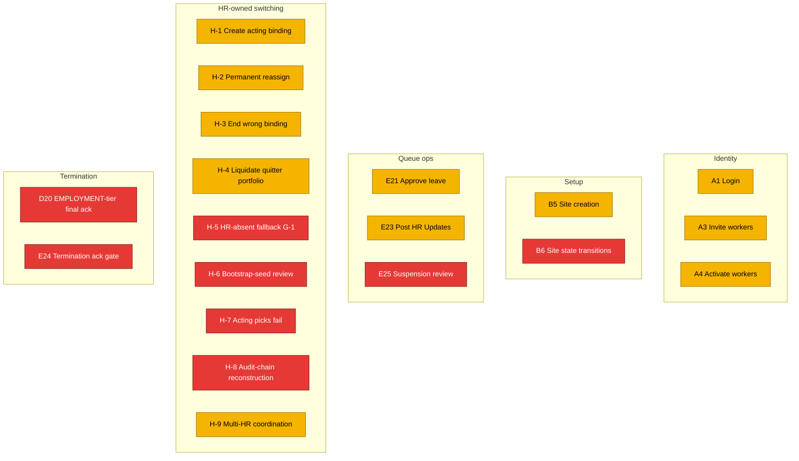

# Execution State — HR (Kavitha)

**Persona:** O.2 Kavitha — HR control plane operator at Surya Cleaning. Currently runs payroll + HR via 3 Excel sheets + Tally + Gmail + WhatsApp. Reddy's sister-in-law; high relational stake. Multi-HR-user team at 5K-scale (Kavitha + Anita + Vikram + Priya + Deepak). Persona detail: `~/.claude/plans/now-i-think-it-functional-kernighan.md` §O.2. Audit: `docs/audits/2026-05-15-1yr-sim-hr-kavitha.md` (H-1 through H-9 switching scope).

**Surface mapping:** HR control plane lives in `apps/admin-web/` — but the HR portal **does not exist yet**. `ls apps/admin-web/app/` shows: about / api / contact / login / owner / pricing / privacy / system / terms — **no HR route**. The closure spec §4 HR pod model is locked in schema but the admin-web HR portal is the largest unbuilt surface in the system.

## Mermaid overview (HR workflow build state from Kavitha's seat)



Legend: green/yellow/red as elsewhere. Backend-side primitives for many H-rows are PARTIAL (table + helpers exist); the admin-web HR portal surface to operate them is the universal red.

## Current active slice affecting Kavitha

**None directly today.** Routing slice (paused @84ae39c) is supervisor-read-side. HR write-side surfaces (H-1 through H-9) are queued but not started.

## Known risks / drift watchouts

- **HR portal does not exist.** Layer 2 surface work. All H-rows that need it are `NOT_STARTED` from Kavitha's seat.
- **Multi-HR-user partitioning + locking (H-9)** is silent across all 6 active specs. Closure spec §4 introduces the HR pod model + Decision 1 partition; queue lock kinds are catalogued (`HR_QUEUE_LOCK_*`) but no lock columns / no service code.
- **HR-absent fallback (G-1 / H-5)** has explicit policy in closure Decision 2 (tiered: backup pod owner 24h → cross-pod 48h → owner emergency 72h). Zero implementation. Hard for friend to verify without it.
- **Bootstrap seed (H-6, pick 8)** lands with HR portal slice — no current path.

## Recent commits touching this persona

```
9c0b3d8 feat(schema): SiteSupervisorBinding (substrate for H-1, H-2, H-3, H-4)
ec40813 test(schema): HRPod + Policy + Membership.podId real-DB tests (H-9 substrate)
f609749 feat(audit): typed audit-emit helpers for Policy + Membership pod (H-9 substrate)
095c766 feat(schema): Layer 1 core primitives — HRPod + Policy + Notification + Digest
```

All shipped commits are schema/helper substrate. No HR-facing surface code.

## Workflow rows

---

### A1 — Phone OTP login (Kavitha via admin-web)

- **Persona:** HR (Kavitha)
- **Design verdict:** WORKS
- **Implementation state:** PARTIAL
- **Verification state:** UNVERIFIED (HR seat)
- **What works now:** Same auth backend as supervisor; admin-web `apps/admin-web/app/login/` exists.
- **What does not work yet:** No HR landing surface after login — `apps/admin-web/app/owner/` exists but `apps/admin-web/app/hr/` does not.
- **Files / tests / commit refs:** `apps/admin-web/app/login/`.
- **Current owner / current slice:** none
- **Next required step:** Build `apps/admin-web/app/hr/` shell.

---

### A3 — Worker invitation (Kavitha initiates)

- **Persona:** HR (Kavitha)
- **Design verdict:** WORKS
- **Implementation state:** PARTIAL
- **Verification state:** UNVERIFIED (HR seat)
- **What works now:** Backend `apps/backend/src/routes/workers.ts` accepts worker creation.
- **What does not work yet:** No HR portal form. No bulk-invite path.
- **Files / tests / commit refs:** Backend: `apps/backend/src/routes/workers.ts`.
- **Current owner / current slice:** none
- **Next required step:** HR portal worker-invite form.

---

### A4 — Worker doc collection review (Kavitha)

- **Persona:** HR (Kavitha)
- **Design verdict:** WORKS
- **Implementation state:** PARTIAL
- **Verification state:** UNVERIFIED
- **What works now:** Worker state machine has DOC_PENDING → ACTIVE.
- **What does not work yet:** No HR review surface; no doc viewer.
- **Files / tests / commit refs:** —
- **Current owner / current slice:** none
- **Next required step:** HR portal doc-review surface.

---

### B5 — Site creation (Kavitha one-time setup)

- **Persona:** HR (Kavitha)
- **Design verdict:** WORKS
- **Implementation state:** PARTIAL
- **Verification state:** UNVERIFIED
- **What works now:** Backend Site model + creation path.
- **What does not work yet:** No HR portal site-create form.
- **Files / tests / commit refs:** —
- **Current owner / current slice:** none
- **Next required step:** HR portal site management screen.

---

### B6 — Site state transitions (Kavitha manual)

- **Persona:** HR (Kavitha)
- **Design verdict:** WORKS
- **Implementation state:** NOT_STARTED
- **Verification state:** UNVERIFIED
- **What works now:** Site.state column.
- **What does not work yet:** State machine wiring placeholder; no HR transition UI.
- **Files / tests / commit refs:** —
- **Current owner / current slice:** none
- **Next required step:** State-machine code + HR surface.

---

### E21 — Leave request approval (Kavitha approves/rejects)

- **Persona:** HR (Kavitha)
- **Design verdict:** BROKEN at scale (Month 6 audit — queue overload)
- **Implementation state:** PARTIAL
- **Verification state:** UNVERIFIED (HR seat)
- **What works now:** Backend leave-requests route handles state transitions. SLA tiers locked in closure Decision 3 (URGENT 2h / NEXT_DAY 24h / STANDARD 7d / DIGEST).
- **What does not work yet:** HR queue surface; SLA enforcement; age-based escalation cron.
- **Files / tests / commit refs:** Backend: `apps/backend/src/routes/leave-requests.ts`.
- **Current owner / current slice:** none
- **Next required step:** HR queue UI + SLA wiring.

---

### E23 — HR Update post (Kavitha posts)

- **Persona:** HR (Kavitha)
- **Design verdict:** WORKS (post side) — audience model locked at launch
- **Implementation state:** PARTIAL
- **Verification state:** UNVERIFIED
- **What works now:** HRUpdate entity exists.
- **What does not work yet:** POST /hr-updates route partial per closure-spec Phase 1 findings; HR portal post composer absent.
- **Files / tests / commit refs:** —
- **Current owner / current slice:** none
- **Next required step:** Finish POST route + HR portal composer.

---

### E25 — Worker suspension review (Kavitha)

- **Persona:** HR (Kavitha)
- **Design verdict:** MISSING (no return-date surface)
- **Implementation state:** NOT_STARTED
- **Verification state:** UNVERIFIED
- **What works now:** —
- **What does not work yet:** Suspension lifecycle not modelled.
- **Files / tests / commit refs:** —
- **Current owner / current slice:** none
- **Next required step:** Design pass.

---

### H-1 — Create acting-coverage binding (F26 orchestration)

- **Persona:** HR (Kavitha)
- **Design verdict:** WORKS (closure §4 + responsibility-model §5.7) — but admin-web HR portal absent
- **Implementation state:** PARTIAL
- **Verification state:** REAL_DB (schema)
- **What works now:** SiteSupervisorBinding table + EXCLUDE + CHECK constraints; raw Prisma create works (tests prove it). `recordBindingCreated` audit helper exists.
- **What does not work yet:** No HR portal binding-creation form. No capacity-context panel (current site count + recent decision volume per supervisor) — closure §4 mandate.
- **Files / tests / commit refs:** Backend: `apps/backend/src/lib/site-supervisor-binding.ts`, `apps/backend/test/binding-create-acting.test.ts`.
- **Current owner / current slice:** none
- **Next required step:** HR portal acting-window create form + capacity-context panel.

---

### H-2 — Permanent reassignment (F27 orchestration)

- **Persona:** HR (Kavitha)
- **Design verdict:** WORKS (with the P1.5 future-dated fix `44a453d`)
- **Implementation state:** PARTIAL
- **Verification state:** REAL_DB (schema)
- **What works now:** `reassignPermanentBinding` service helper supports cutover-now and future-dated handoffs. Old row's effectiveUntil bounds the planned end; new row inserts atomically; both audit events emitted.
- **What does not work yet:** No HR portal "switch all sites" convenience UI. No multi-site bulk-reassign affordance.
- **Files / tests / commit refs:** Backend: `apps/backend/src/lib/site-supervisor-binding.ts`, `apps/backend/test/binding-permanent-reassignment-basics.test.ts`.
- **Current owner / current slice:** none
- **Next required step:** HR portal permanent-reassign UI.

---

### H-3 — End a wrong binding (F26.11 correction)

- **Persona:** HR (Kavitha)
- **Design verdict:** WORKS (mechanism); UI deferred per responsibility-model §10
- **Implementation state:** PARTIAL
- **Verification state:** REAL_DB (schema)
- **What works now:** `endedAt` column + `recordBindingEndedManual` helper. Test cases for manual end pass.
- **What does not work yet:** No HR portal "end this binding" button. No audit-chain reconstruction UX.
- **Files / tests / commit refs:** Backend: `apps/backend/src/lib/site-supervisor-binding.ts`, `apps/backend/test/binding-acting-window-basics.test.ts`.
- **Current owner / current slice:** none
- **Next required step:** HR portal manual-end UI.

---

### H-4 — Liquidate quitter portfolio

- **Persona:** HR (Kavitha)
- **Design verdict:** WORKS (via reassign per ops §8)
- **Implementation state:** PARTIAL
- **Verification state:** UNVERIFIED at-flow
- **What works now:** Multiple `reassignPermanentBinding` calls in sequence would liquidate a quitter's portfolio. Schema supports it.
- **What does not work yet:** No HR portal "transfer portfolio" affordance. No bulk-reassign single-screen flow.
- **Files / tests / commit refs:** —
- **Current owner / current slice:** none
- **Next required step:** HR portal transfer-portfolio UI.

---

### H-5 — HR-absent fallback (G-1)

- **Persona:** HR (Kavitha)
- **Design verdict:** WORKS (closure Decision 2 — tiered: backup 24h → cross-pod 48h → owner emergency 72h)
- **Implementation state:** NOT_STARTED
- **Verification state:** UNVERIFIED
- **What works now:** HRPod table has primaryOwnerUserId + backupOwnerUserId columns. Policy can store SLA values.
- **What does not work yet:** No fallback logic. AuditEvent kinds `HR_FALLBACK_INVOKED` + `EMERGENCY_OVERRIDE_ACTIVATED` are catalogued but no emitter. No cron sweep for tier escalation.
- **Files / tests / commit refs:** —
- **Current owner / current slice:** none
- **Next required step:** Implement fallback state machine + cron escalation.

---

### H-6 — Bootstrap-seed review (pick 8)

- **Persona:** HR (Kavitha)
- **Design verdict:** WORKS (closure Decision 6 — two surfaces)
- **Implementation state:** NOT_STARTED
- **Verification state:** UNVERIFIED
- **What works now:** Audit kinds `BOOTSTRAP_SEED_CONFIRMED` + `BOOTSTRAP_SEED_REASSIGNED` catalogued. Closure spec defines the surface contract.
- **What does not work yet:** No seed migration script. No HR portal review UI. Bulk-confirm + per-row reassign affordance absent.
- **Files / tests / commit refs:** —
- **Current owner / current slice:** none
- **Next required step:** Migration script + HR portal seed-review UI.

---

### H-7 — Acting picks fail (F26.10 / C-7.10)

- **Persona:** HR (Kavitha)
- **Design verdict:** WORKS (ops §7.10 — cancel + pick another)
- **Implementation state:** NOT_STARTED
- **Verification state:** UNVERIFIED
- **What works now:** —
- **What does not work yet:** No cancel-and-repick surface. Logical mechanism in raw Prisma works (delete + create new) but isn't exposed.
- **Files / tests / commit refs:** —
- **Current owner / current slice:** none
- **Next required step:** HR portal cancel + repick flow.

---

### H-8 — Audit-chain reconstruction (G-4)

- **Persona:** HR (Kavitha)
- **Design verdict:** WORKS (closure Decision 6 — audit-chain timeline view)
- **Implementation state:** NOT_STARTED
- **Verification state:** UNVERIFIED
- **What works now:** AuditEvent rows preserve full history; BINDING\_\* events include `previousUserId`, `newBindingId`, etc. for chain walking.
- **What does not work yet:** No timeline UI. No filter-by-site / filter-by-supervisor / filter-by-actor surface.
- **Files / tests / commit refs:** Backend: `recordBindingEndedSupersededByPermanent` payload includes the chain anchors.
- **Current owner / current slice:** none
- **Next required step:** HR portal audit-chain timeline UI.

---

### H-9 — Multi-HR coordination

- **Persona:** HR (Kavitha)
- **Design verdict:** WORKS (closure Decision 1 — HR pod model + pessimistic per-row lock for HR queue items)
- **Implementation state:** PARTIAL
- **Verification state:** REAL_DB (schema)
- **What works now:** HRPod table; Membership.podId column; pod assignment audit helpers tested (`recordMembershipPodAssigned`/`Reassigned`).
- **What does not work yet:** No queue partitioning logic. No lock columns or service code. No cross-pod override flow (kind `HR_CROSS_POD_OVERRIDE_USED` catalogued, no emitter).
- **Files / tests / commit refs:** Backend: `apps/backend/src/lib/audit-event.ts`, `apps/backend/test/membership-pod-assignment-audit.test.ts`.
- **Current owner / current slice:** none
- **Next required step:** Queue lock columns + service code + HR portal queue UI.

---

### D20 / E24 — EMPLOYMENT-tier final ack gate (Kavitha)

- **Persona:** HR (Kavitha)
- **Design verdict:** WORKS (closure §5.3.9 + Decision 7)
- **Implementation state:** NOT_STARTED
- **Verification state:** UNVERIFIED
- **What works now:** originContext + proposedDuringAbsence columns persist proposer context. Schema supports the gate.
- **What does not work yet:** No HR ack screen. No typed-phrase capture. No "decision-support panel" UI (closure §5.3.9). No 3-audience push wiring.
- **Files / tests / commit refs:** Schema-side only.
- **Current owner / current slice:** none
- **Next required step:** HR portal ack-screen + typed-phrase + decision-support panel.
