# Execution State — Worker (Suresh)

**Persona:** O.4 Suresh — Bihar migrant worker at Surya Cleaning's Lakeview site. Hindi-first; basic English; Telugu near-zero. ₹6K Realme phone, 80% storage full. Earns ~₹14K/month. Persona fears: late pay, false accusation, firing without notice. Daily user (when worker app exists). Persona detail: `~/.claude/plans/now-i-think-it-functional-kernighan.md` §O.4.

**Surface mapping:** Backend routes write `Worker` / `Visit` / `Assignment` / `LeaveRequest` / `Attendance` rows but **no worker mobile app exists in the repo today.** `find apps -maxdepth 2 -name "worker-mobile"` returns nothing. Every Suresh-side workflow has Implementation state = `NOT_STARTED` from his seat, even when the backend is `BUILT`. This is the headline finding of his audit (`docs/audits/2026-05-14-1yr-sim-worker-suresh.md`): the worker is currently **structurally invisible** to himself.

## Mermaid overview (worker workflow build state from Suresh's seat)

```mermaid
graph TB
    classDef built fill:#1e8e3e,stroke:#0b6624,color:#fff
    classDef partial fill:#f5b400,stroke:#8a6900,color:#000
    classDef notstarted fill:#e53935,stroke:#7a1715,color:#fff
    classDef blocked fill:#8e24aa,stroke:#4a1361,color:#fff

    subgraph "Identity (worker app does not exist)"
        A1[A1 OTP login]:::notstarted
        A3[A3 Activation experience]:::notstarted
        A4[A4 Doc upload]:::notstarted
    end

    subgraph "Day-to-day work"
        B9[B9 Sees own assignments]:::notstarted
        C11[C11 Subject of MARK_ABSENT]:::notstarted
        C12[C12 Visit lifecycle]:::notstarted
        C14[C14 Photo verification UX]:::notstarted
        C15[C15 Audit reversal subject-view]:::notstarted
    end

    subgraph "Self-service"
        E21[E21 Leave request initiator]:::notstarted
        E22[E22 Swap accept/reject]:::notstarted
        F28[F28 Replacement invite respond]:::notstarted
    end

    subgraph "Notifications about Suresh"
        D17[D17 Subject of decisions]:::notstarted
        D20[D20 Termination subject]:::notstarted
        E23[E23 HR Updates if worker audience]:::notstarted
        E24[E24 Termination notification]:::notstarted
        E25[E25 Suspension notification]:::notstarted
    end

    subgraph "Supervisor change awareness"
        F26[F26 Acting cover - W-1/W-2/W-7]:::notstarted
        F27[F27 Permanent reassignment - W-3]:::notstarted
    end
```



Legend: every node is **red (NOT_STARTED) from Suresh's perspective** because the worker app does not exist. Many backends behind these nodes are BUILT or PARTIAL — see per-row "What works now (backend)" lines. The persona file's red colour is intentional and the friend's audit finding.

## Current active slice affecting Suresh

**None directly.** The routing slice (paused @84ae39c) affects supervisor-side routing of decisions; it does not surface anything new to Suresh. Worker-side surfaces remain entirely unstarted.

## Known risks / drift watchouts

- **The worker app does not exist.** Every "the experience" workflow in the audit set has zero surface today. If a future session reads "C11 backend BUILT + tests green" out of context, it might infer Suresh can see absence marks — he cannot. Always cross-check the **persona-surface** column, not just backend state.
- **W-1 through W-8 switching coverage** (Suresh audit §worker-switching-scope) is the single biggest cross-cutting gap. Closure spec Decision 4 freezes the policy (mandatory push + in-app banner + SMS fallback, localised) but the consumer surface to render it does not exist.
- **Bilateral swap acceptance (E22) is a design MISSING**, not just a code gap. Audit Month 6.5 flagged this — the workflow design itself has no answer for "worker B accepts worker A's swap." Will need design + code.
- **Termination notification (E24/W-4)** is structurally the most consequential moment for Suresh and is fully offline today — the chat-side AuditEvent `WORKER_TERMINATION_REQUESTED` does nothing visible to the worker. Friend's review Round 2 flagged this as `BROKEN` design at scale.

## Recent commits touching this persona

```
# Worker-relevant commits (backend-side capacity built for worker surfaces that don't yet exist):
9c0b3d8 feat(schema): SiteSupervisorBinding table — F26/F27 worker-side notifications gated on this
095c766 feat(schema): Layer 1 core primitives — Worker.preferredLanguage column landed (closure §5.1)

# No worker-mobile commits exist. Branch / folder does not exist.
```

## Workflow rows

---

### A1 — Phone OTP login (worker-app login)

- **Persona:** Worker (Suresh)
- **Design verdict:** WORKS (backend) — `MISSING` for worker because the worker login surface doesn't exist
- **Implementation state:** NOT_STARTED (from Suresh's seat)
- **Verification state:** UNVERIFIED (worker side)
- **What works now (backend):** `apps/backend/src/routes/auth.ts` is role-agnostic — same OTP flow would work for Worker users when the app exists.
- **What does not work yet:** No worker mobile app. No Worker→User onboarding path in app. No worker phone screen.
- **Files / tests / commit refs:** Backend: `apps/backend/src/routes/auth.ts`. Frontend: nothing.
- **Current owner / current slice:** none
- **Next required step:** Worker mobile app scaffolding (new app folder `apps/worker-mobile/`).

---

### A3 — Worker invitation → activation (Suresh's lived experience)

- **Persona:** Worker (Suresh)
- **Design verdict:** MISSING from Suresh's side (audit Day 1 — "blank home")
- **Implementation state:** NOT_STARTED
- **Verification state:** UNVERIFIED
- **What works now (backend):** Worker creation + state-machine transitions in `apps/backend/src/routes/workers.ts` + `packages/state-machines/src/worker.ts`. HR invitation path partially built.
- **What does not work yet:** Suresh has no app to open, no activation card, no DOC_PENDING surface. Friend's audit explicitly: "Day 1 — blank home: workflow design has no worker home shell → MISSING design (not just unbuilt)."
- **Files / tests / commit refs:** Backend: `apps/backend/src/routes/workers.ts`. Frontend: none.
- **Current owner / current slice:** none
- **Next required step:** Worker app design pass + scaffolding.

---

### A4 — Worker doc collection → ACTIVE

- **Persona:** Worker (Suresh)
- **Design verdict:** MISSING (no signal that activation happened)
- **Implementation state:** NOT_STARTED
- **Verification state:** UNVERIFIED
- **What works now (backend):** WorkerState machine has DOC_PENDING → ACTIVE.
- **What does not work yet:** No upload surface. No "you're now active" notification. Suresh sees activation as silent silence per audit Day 5.
- **Files / tests / commit refs:** Backend: `packages/state-machines/src/worker.ts`.
- **Current owner / current slice:** none
- **Next required step:** Worker app + doc upload UI + activation notification.

---

### B9 — Direct assignment (Suresh as subject)

- **Persona:** Worker (Suresh)
- **Design verdict:** MISSING from Suresh's side
- **Implementation state:** NOT_STARTED
- **Verification state:** UNVERIFIED
- **What works now (backend):** Backend creates Assignment rows.
- **What does not work yet:** Suresh has no schedule view, no "you're assigned to Lakeview today" surface.
- **Files / tests / commit refs:** —
- **Current owner / current slice:** none
- **Next required step:** Worker app schedule screen.

---

### C11 — Mark worker absent (Suresh's experience as subject)

- **Persona:** Worker (Suresh)
- **Design verdict:** MISSING (no dispute path — audit Day 3)
- **Implementation state:** NOT_STARTED
- **Verification state:** UNVERIFIED
- **What works now (backend):** Supervisor marks absent + payDeductPaise computed. AuditEvent emitted.
- **What does not work yet:** Suresh has no surface to see he was marked absent. No false-absence dispute path. Audit named this as `MISSING` design — the workflow has no answer for "Suresh was actually present but supervisor marked absent."
- **Files / tests / commit refs:** Backend: `apps/backend/src/routes/workers.ts` (mark-absent).
- **Current owner / current slice:** none
- **Next required step:** Design pass on worker dispute path + worker app surface for attendance visibility.

---

### C12 — Visit lifecycle (Suresh starts/ends visits)

- **Persona:** Worker (Suresh)
- **Design verdict:** MISSING (SCHEDULED → IN_PROGRESS trigger not locked — audit Day 2)
- **Implementation state:** NOT_STARTED
- **Verification state:** UNVERIFIED
- **What works now (backend):** Visit model + 12-state machine. `POST /visits/:id/end` route exists.
- **What does not work yet:** No worker-side start/end UI. No way for Suresh to mark himself on-site. The trigger that flips SCHEDULED → IN_PROGRESS is undefined.
- **Files / tests / commit refs:** Backend: `apps/backend/src/routes/visits.ts`.
- **Current owner / current slice:** none
- **Next required step:** Design pass on visit-start trigger + worker visit surface.

---

### C14 — Visit photo verification (Suresh's subject experience)

- **Persona:** Worker (Suresh)
- **Design verdict:** MISSING (subject-side visibility — audit Day 4)
- **Implementation state:** NOT_STARTED
- **Verification state:** UNVERIFIED
- **What works now (backend):** Visit.flagged + VisitPhoto exist; outbox `ai.verify` enqueued.
- **What does not work yet:** Suresh has no visibility when his photos are flagged. The AI adjudication is fully invisible to him.
- **Files / tests / commit refs:** Backend: `apps/backend/src/routes/visits.ts`, `packages/shared-schema/prisma/schema.prisma` (VisitPhoto).
- **Current owner / current slice:** none
- **Next required step:** Worker flag-visibility surface (deferred until worker app + AI dispatcher land).

---

### C15 — Audit reversal (Suresh's subject view)

- **Persona:** Worker (Suresh)
- **Design verdict:** DRIFT (R6 vs D.1 window mismatch — F-P-4 pending)
- **Implementation state:** NOT_STARTED
- **Verification state:** UNVERIFIED
- **What works now:** —
- **What does not work yet:** Even if the reversal route existed, Suresh has no surface to be informed.
- **Files / tests / commit refs:** —
- **Current owner / current slice:** none
- **Next required step:** F-P-4 founder pick → reversal route → worker notification.

---

### D17 — Decision apply (Suresh as decision subject)

- **Persona:** Worker (Suresh)
- **Design verdict:** MISSING from Suresh's side
- **Implementation state:** NOT_STARTED
- **Verification state:** UNVERIFIED
- **What works now (backend):** SupervisorDecision schema; routing read API (WIP). Subject of decisions (Suresh) is in the targetId.
- **What does not work yet:** No worker-side notification when a decision about Suresh is applied (per closure Decision 4 worker-supervisor-change + Decision 5 termination).
- **Files / tests / commit refs:** Backend: `apps/backend/src/lib/effective-responsibility.ts` (WIP @84ae39c).
- **Current owner / current slice:** Routing slice (paused) is the supervisor side; Suresh side not in scope.
- **Next required step:** Worker app + notification surface.

---

### D20 — EMPLOYMENT-tier ack (Suresh as termination subject)

- **Persona:** Worker (Suresh)
- **Design verdict:** BROKEN (worker's most consequential moment is fully offline — audit Month 11)
- **Implementation state:** NOT_STARTED
- **Verification state:** UNVERIFIED
- **What works now (backend):** originContext + proposedDuringAbsence columns persist termination context. HR-ack-gate schema exists.
- **What does not work yet:** Suresh has no surface when his termination is proposed, acked, or applied. The friend's audit Round 2 flagged this as the single most-consequential gap.
- **Files / tests / commit refs:** Schema-side only.
- **Current owner / current slice:** none
- **Next required step:** Worker app + closure Decision 5 surface (in-app + appeal window + records export).

---

### E21 — Leave request (Suresh initiates)

- **Persona:** Worker (Suresh)
- **Design verdict:** BROKEN at worker-self-initiative (design assumes supervisor-on-behalf — audit Week 2)
- **Implementation state:** NOT_STARTED
- **Verification state:** UNVERIFIED
- **What works now (backend):** Backend LeaveRequest create + transitions in `apps/backend/src/routes/leave-requests.ts`. Route currently shapes around supervisor as creator.
- **What does not work yet:** Worker-self-initiation path. No worker UI. Closure spec freezes 3 SLA tiers but worker-side request UX doesn't exist.
- **Files / tests / commit refs:** Backend: `apps/backend/src/routes/leave-requests.ts`.
- **Current owner / current slice:** none
- **Next required step:** Worker app leave-request form + backend acceptance of worker-initiated requests.

---

### E22 — Worker swap accept/reject (Suresh as B side)

- **Persona:** Worker (Suresh)
- **Design verdict:** MISSING (bilateral acceptance not designed — audit Month 6.5)
- **Implementation state:** NOT_STARTED
- **Verification state:** UNVERIFIED
- **What works now (backend):** SwapRequest entity exists; 12-state machine. Currently only fromWorker→toWorker direction is named.
- **What does not work yet:** toWorker has no accept/reject surface. The workflow design itself doesn't specify how acceptance is captured.
- **Files / tests / commit refs:** —
- **Current owner / current slice:** none
- **Next required step:** Design pass on bilateral swap + worker app.

---

### E23 — HR Update (if audience extended to workers)

- **Persona:** Worker (Suresh)
- **Design verdict:** BROKEN at scale (audience-model excludes workers per closure §7 audience amendment for pay-affecting only — telephone via supervisor WhatsApp)
- **Implementation state:** NOT_STARTED
- **Verification state:** UNVERIFIED
- **What works now (backend):** HRUpdate entity exists.
- **What does not work yet:** Worker audience is opt-in per Policy `audienceWorkers=true` for pay-affecting; the worker-side delivery surface doesn't exist. Suresh learns policy via supervisor's WhatsApp today.
- **Files / tests / commit refs:** —
- **Current owner / current slice:** none
- **Next required step:** Worker app HR-update feed + Policy gate.

---

### E24 — Worker termination (Suresh as subject)

- **Persona:** Worker (Suresh)
- **Design verdict:** BROKEN (most consequential moment fully offline — audit Month 11)
- **Implementation state:** NOT_STARTED
- **Verification state:** UNVERIFIED
- **What works now (backend):** Chat AuditEvent `WORKER_TERMINATION_REQUESTED` is emitted; Worker.state transitions to TERMINATION_PENDING.
- **What does not work yet:** Closure Decision 5 specifies in-app push + 7-day appeal + records export — none implemented. No worker-side push, no appeal form, no export.
- **Files / tests / commit refs:** Backend: `apps/backend/src/routes/chat.ts:786`.
- **Current owner / current slice:** none
- **Next required step:** Closure Decision 5 implementation — worker app + termination surface + appeal flow + records export.

---

### E25 — Worker suspension (Suresh as subject)

- **Persona:** Worker (Suresh)
- **Design verdict:** MISSING (no return-date surface — audit Month 7)
- **Implementation state:** NOT_STARTED
- **Verification state:** UNVERIFIED
- **What works now:** —
- **What does not work yet:** Suspension lifecycle not modelled.
- **Files / tests / commit refs:** —
- **Current owner / current slice:** none
- **Next required step:** Design pass.

---

### F26 — Acting supervisor coverage (W-1 + W-2 + W-7 — Suresh sees new face)

- **Persona:** Worker (Suresh)
- **Design verdict:** MISSING (spec silent on worker-side notification — audit Month 8, headline Suresh case)
- **Implementation state:** NOT_STARTED
- **Verification state:** UNVERIFIED
- **What works now (backend):** SiteSupervisorBinding table records the acting binding. `getEffectiveBinding` returns the acting supervisor.
- **What does not work yet:** Closure Decision 4 mandates push + in-app banner + SMS fallback + localised — none implemented. Worker app doesn't exist. AuditEvent kind `WORKER_SUPERVISOR_CHANGE_NOTIFIED` is in the catalogue but no emitter, no consumer.
- **Files / tests / commit refs:** Backend: `apps/backend/src/lib/site-supervisor-binding.ts`.
- **Current owner / current slice:** none
- **Next required step:** Worker app + emitter + Closure Decision 4 surface.

---

### F27 — Permanent portfolio reassignment (W-3 — Suresh sees new permanent supervisor)

- **Persona:** Worker (Suresh)
- **Design verdict:** MISSING
- **Implementation state:** NOT_STARTED
- **Verification state:** UNVERIFIED
- **What works now (backend):** Reassign helper (`reassignPermanentBinding`) supports the schema-side; future-dated cutover works.
- **What does not work yet:** Worker-side notification — same gap as F26 above. No surface; no emitter wired.
- **Files / tests / commit refs:** Backend: `apps/backend/src/lib/site-supervisor-binding.ts`.
- **Current owner / current slice:** none
- **Next required step:** Same as F26.

---

### F28 — Replacement invite (Suresh accepts/rejects)

- **Persona:** Worker (Suresh)
- **Design verdict:** MISSING (R6 surface supervisor-only; worker surface unmapped — audit Day 7 / W-6)
- **Implementation state:** NOT_STARTED
- **Verification state:** UNVERIFIED
- **What works now:** Lifecycle locked in D.1 spec.
- **What does not work yet:** Worker-side respond UI absent. 2-min TTL pressure cannot be exercised.
- **Files / tests / commit refs:** —
- **Current owner / current slice:** none
- **Next required step:** Worker app + accept/reject surface.
