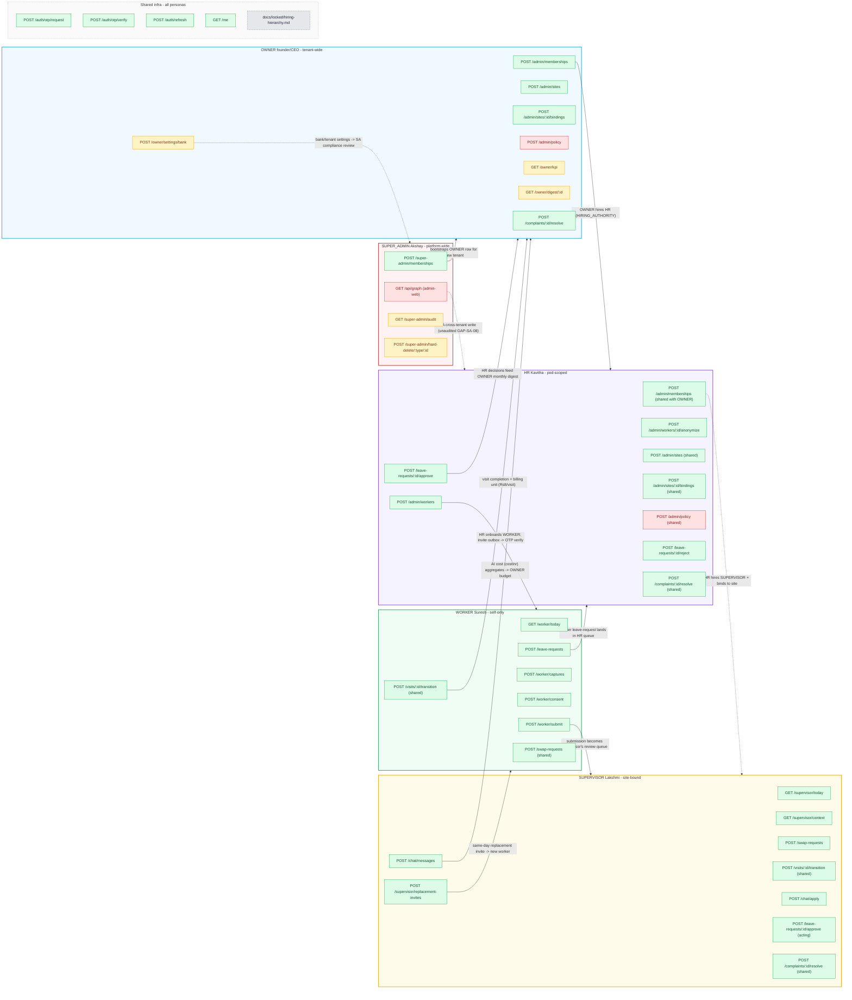

# AXHY persona-route map — Mermaid prototype

**Snapshot:** main @ 1c4859f &middot; **Generated:** 2026-05-31
**Sources:** EVID-HR-A1-PLAYWRIGHT, EVID-OWNER-PERSONA-MAP (slice-2 branch), EVID-SUPER-ADMIN-PERSONA-MAP (slice-3 branch), backend route grep.

This is **prototype 2** of two. Same data as `../prototype-html/index.html`, rendered as a single Mermaid `flowchart LR` so GitHub previews it natively.

## How to read this

- Five **subgraphs**, one per persona. Box color = persona.
- Each **node** inside a subgraph = a route that persona calls.
- **Arrows between subgraphs** = cross-persona data flow (data created by one persona that feeds another's surface).
- Status is encoded via CSS class: green = working, red = broken/invariant-gap, amber = planned, gray = locked constitutional doc.
- Mermaid does not show route metadata (reads/writes/side-effects) — hover-detail is impossible. See the table at the bottom for those contracts.

## Legend

| Symbol | Meaning                                                        |
| ------ | -------------------------------------------------------------- |
| green  | Route exists on `main`, audited this session, behaves as spec. |
| red    | Route exists but has a known invariant violation or audit gap. |
| amber  | Route does NOT exist on `main`; called out as gap in an EVID.  |
| gray   | Constitutional / panel-locked (docs/locked/...).               |
| arrow  | Cross-persona data flow (label says via which route).          |

## The graph

## Route contracts (the data Mermaid cannot show)

This table carries the reads/writes/side-effects that the diagram drops.

| route                                   | reads                             | writes                             | side-effects                                | status  |
| --------------------------------------- | --------------------------------- | ---------------------------------- | ------------------------------------------- | ------- |
| POST /super-admin/memberships           | Company                           | User, Membership, AuditLog         | AuditLog kind=MEMBERSHIP_CREATED            | working |
| POST /auth/otp/request                  | User                              | OtpAttempt                         | SMS send                                    | working |
| POST /auth/otp/verify                   | User, Membership, OtpAttempt      | RefreshToken                       | JWT issuance + isPlatformAdmin claim        | working |
| POST /auth/refresh                      | RefreshToken, User, Membership    | RefreshToken (rotation)            | F1-b family-rotation                        | working |
| GET /me                                 | User, Membership                  | -                                  | -                                           | working |
| POST /admin/memberships                 | Membership, User, Pod             | Membership, User, AuditLog         | Invite outbox                               | working |
| POST /admin/workers                     | Pod, User                         | Worker, User, AuditLog             | Worker invite outbox                        | working |
| POST /admin/workers/:id/anonymize       | Worker                            | Worker (PII redact), AuditLog      | Audit chain                                 | working |
| POST /admin/sites                       | Site (uniqueness)                 | Site, AuditLog                     | -                                           | working |
| POST /admin/sites/:id/bindings          | Site, Membership                  | SiteSupervisorBinding, AuditLog    | -                                           | working |
| POST /admin/policy                      | Policy (version chain)            | Policy (new version), AuditLog     | policy-changed outbox; SA bypass UNAUDITED  | broken  |
| POST /leave-requests                    | Worker                            | LeaveRequest                       | HR notification                             | working |
| POST /leave-requests/:id/approve        | LeaveRequest, Worker              | LeaveRequest.status, AuditLog      | Worker notification; schedule reflow        | working |
| POST /leave-requests/:id/reject         | LeaveRequest                      | LeaveRequest.status, AuditLog      | Worker notification                         | working |
| GET /worker/today                       | Visit, Site, Assignment           | -                                  | -                                           | working |
| POST /worker/submit                     | Visit, Capture                    | Visit.status, Submission, AuditLog | Verification pipeline trigger; billing unit | working |
| POST /worker/captures                   | Visit                             | Capture, S3 object                 | Photo upload                                | working |
| POST /worker/consent                    | Worker                            | WorkerConsent, AuditLog            | -                                           | working |
| GET /supervisor/today                   | Site, Visit, Worker               | -                                  | -                                           | working |
| GET /supervisor/context                 | Site, Binding                     | -                                  | -                                           | working |
| POST /supervisor/replacement-invites    | Visit                             | ReplacementInvite                  | SMS to candidate worker                     | working |
| POST /swap-requests                     | Assignment                        | SwapRequest                        | Notification                                | working |
| POST /visits/:id/transition             | Visit                             | Visit.status, AuditLog             | State machine; billing-unit increment       | working |
| POST /complaints/:id/resolve            | Complaint                         | Complaint.status, AuditLog         | Reporter notification                       | working |
| POST /chat/messages                     | Policy, LivingDoc                 | ChatMessage, AiUsage               | OpenAI call; cost tracked in costInr        | working |
| POST /chat/apply                        | ChatMessage                       | Policy / LivingDoc edit, AuditLog  | LivingDoc update                            | working |
| GET /api/graph (admin-web)              | KnowledgeGraph (raw pg, x-tenant) | -                                  | NO AuditLog (invariant violation GAP-SA-05) | broken  |
| GET /owner/kpi                          | Visit aggregates, AiUsage agg.    | -                                  | -                                           | planned |
| GET /owner/digest/:id                   | Digest                            | -                                  | WhatsApp send (via cron upstream)           | planned |
| POST /owner/settings/bank               | Company                           | Company.bankAccount, AuditLog      | 2-step OTP confirm                          | planned |
| GET /super-admin/audit                  | AuditLog (x-tenant), SAAccessLog  | SuperAdminAccessLog                | Per-tenant access audit                     | planned |
| POST /super-admin/hard-delete/:type/:id | target row                        | delete + AuditLog + SAAccessLog    | Irreversible                                | planned |
| docs/locked/hiring-hierarchy.md         | -                                 | -                                  | Drift-tested by role-gates.test.ts          | locked  |

## Summary

- **Personas:** 5
- **Routes shown:** 30 + 1 locked constitutional doc + 4 shared auth/me infra = 35 nodes
- **Cross-persona edges:** 12
- **Status mix:** 26 working, 3 broken/invariant-gap, 5 planned (gaps from EVIDs), 1 locked
