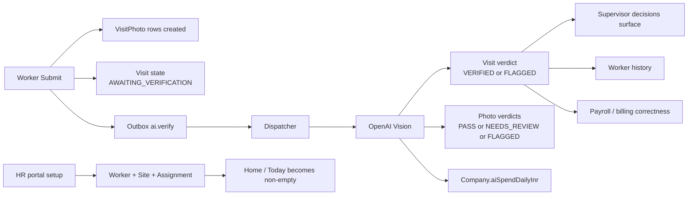

# 01 — Map (built from code BEFORE walking)

**Mapped at:** 2026-06-10 23:50 IST · Snapshot of [../MAP.md](../MAP.md) at commit `02eae2f` — full footprint/API/DB tables live there; this file freezes the walk-order path + Step 1b findings.

## Visual map

Use Markdown preview for this section first. It shows the worker journey as a connected UI path, with secondary routes and the hidden history screen called out separately.

```mermaid
flowchart TD
    A[App Open<br/>index.tsx] --> B[Phone Entry<br/>(auth)/phone.tsx]
    B --> C[OTP Entry<br/>(auth)/otp.tsx]
    C --> D[Permissions<br/>(auth)/permissions.tsx]
    D --> E[Consent<br/>(auth)/consent.tsx]
    E --> F[Home / Today<br/>(worker)/(tabs)/index.tsx]

    F -->|tap visit card| G[Visit Detail<br/>(worker)/visit/[id].tsx]
    F -->|resume capture pointer| H[Capture Entry<br/>capture/[visitId]/qr-scan.tsx]
    G --> H

    H --> I[Before Photos]
    I --> J[Before Review]
    J --> K[Timer / Clock In]
    K --> L[Clock Out]
    L --> M[After Photos]
    M --> N[After Review]
    N --> O[Final Review]
    O --> P[Submit]
    P --> Q[Verify Wait / Polling]
    Q --> R[Async AI Verdict]
    R --> S[Supervisor Flag Surface]

    F --> T[Worker Drawer]
    T --> U[Profile<br/>(tabs)/profile.tsx]
    T --> V[Leave Request<br/>(worker)/leave-request.tsx]
    T --> W[Sign Out]

    X[History<br/>(tabs)/history.tsx]:::orphan
    F -. no visible tap path .-> X

    classDef orphan fill:#ffe5e5,stroke:#b42318,stroke-width:2px,color:#7a271a;
```

### Side-system connections



## Full path (walk order, real-tap navigation only)

| #   | Step                     | Screen (file, under apps/mobile/app)                         | Route(s) called                                              | DB tables touched                                                                       | Side-effects                       |
| --- | ------------------------ | ------------------------------------------------------------ | ------------------------------------------------------------ | --------------------------------------------------------------------------------------- | ---------------------------------- |
| 1   | App open → entry routing | index.tsx                                                    | GET /me (when token)                                         | User, Company, Membership (read)                                                        | —                                  |
| 2   | Phone entry              | (auth)/phone.tsx                                             | POST /auth/otp/request                                       | Redis OTP store                                                                         | WhatsApp send (or bypass skip)     |
| 3   | OTP entry                | (auth)/otp.tsx                                               | POST /auth/otp/verify                                        | User (find/create), Membership, Worker (OTP_VERIFIED transition), RefreshToken create   | AuditEvent AUTH_LOGIN              |
| 4   | Permissions              | (auth)/permissions.tsx                                       | — (OS dialogs)                                               | —                                                                                       | —                                  |
| 5   | Consent (DPDP)           | (auth)/consent.tsx                                           | POST /worker/consent                                         | ConsentLog append                                                                       | 409 ALREADY_CONSENTED handled      |
| 6   | Home (today)             | (worker)/(tabs)/index.tsx                                    | GET /worker/today                                            | Worker, Visit, Site, binding reads                                                      | resume-capture pointer             |
| 7   | Visit detail             | (worker)/visit/[id].tsx (push from home card, index.tsx:167) | GET /worker/visits/:id                                       | Visit, Site, supervisor phone                                                           | tap-to-call                        |
| 8   | Capture entry            | capture/[visitId]/qr-scan.tsx                                | — (camera QR)                                                | —                                                                                       | —                                  |
| 9   | Before photos            | capture/[visitId]/before-photos.tsx (+ CameraView)           | POST /worker/captures/upload-urls (+ R2 PUTs via disk queue) | —                                                                                       | R2 objects v3-captures/{workerId}/ |
| 10  | Before review            | capture/[visitId]/before-photos-review.tsx                   | —                                                            | —                                                                                       | retake state                       |
| 11  | Clock-in → timer         | capture/[visitId]/timer.tsx                                  | POST /worker/visits/:id/clock-in                             | Visit → IN_PROGRESS (one-active-timer guard)                                            | audit                              |
| 12  | Clock-out                | timer.tsx exit                                               | POST /worker/visits/:id/clock-out                            | Visit → PHOTOS_PENDING                                                                  | audit                              |
| 13  | After photos + review    | after-photos.tsx, after-photos-review.tsx                    | upload-urls + R2 PUTs                                        | —                                                                                       | —                                  |
| 14  | Final review             | capture/[visitId]/review.tsx                                 | —                                                            | —                                                                                       | —                                  |
| 15  | Submit                   | capture/[visitId]/submit.tsx                                 | POST /worker/visits/:id/submit                               | VisitPhoto createMany (skipDuplicates), Visit → AWAITING_VERIFICATION                   | Outbox ai.verify (same tx)         |
| 16  | Verify wait              | submit.tsx polling                                           | GET /worker/visits/:id/verify-status                         | Visit.state, VisitPhoto.aiVerifyStatus                                                  | —                                  |
| 17  | (async) AI verdict       | — (dispatcher)                                               | OpenAI vision                                                | Visit → VERIFIED/FLAGGED, VisitPhoto PASS/NEEDS_REVIEW/FLAGGED, Company.aiSpendDailyInr | first-writer-wins claim            |
| 18  | History                  | (tabs)/history.tsx — **UNREACHABLE, see 1b-1**               | GET /worker/history                                          | Visit (terminal states)                                                                 | —                                  |
| 19  | Profile                  | (tabs)/profile.tsx (tab + drawer push)                       | GET /me                                                      | —                                                                                       | —                                  |
| 20  | Leave request            | (worker)/leave-request.tsx (drawer → WorkerDrawer.tsx:113)   | POST /leave-requests                                         | LeaveRequest REQUESTED (self-bound)                                                     | —                                  |
| 21  | Sign out                 | WorkerDrawer.tsx:89                                          | POST /auth/sign-out                                          | RefreshToken revoke LOGOUT                                                              | token wipe → (auth)/phone          |

## Personas touched and when

| Persona    | Enters at step | Sees/does                                                              | Waits for                        | Fears                                                   |
| ---------- | -------------- | ---------------------------------------------------------------------- | -------------------------------- | ------------------------------------------------------- |
| Worker     | 1-21           | everything above                                                       | OTP delivery; upload; AI verdict | "did today count for my pay?"; being accused by AI flag |
| Supervisor | after 17       | flagged visits on their surface; their phone shown for tap-to-call (7) | submit volume                    | missing a fake clean                                    |
| HR         | upstream + 20  | created Worker/Site/Assignment; decides leave                          | leave queue                      | wrong roster data                                       |
| Owner      | 17             | pays AI cost (aiSpendDailyInr)                                         | —                                | being cheated; AI cost runaway                          |

## Connections to other features

Feeds: supervisor-decisions (flags), payroll/billing (billable states, attendance via leave approval), ai-verification (outbox). Fed by: hr-portal (Worker/Site/Assignment rows make /worker/today non-empty). If submit lies → supervisor today, history, payroll, billing all silently wrong.

## Step 1b — Orphan & dead-wiring findings (code-traced, 2026-06-10 23:50 IST)

| Type              | Item                                                                        | Evidence                                                                                                                                                                                  | Verdict                                                                                                                                                                                                                                         |
| ----------------- | --------------------------------------------------------------------------- | ----------------------------------------------------------------------------------------------------------------------------------------------------------------------------------------- | ----------------------------------------------------------------------------------------------------------------------------------------------------------------------------------------------------------------------------------------------- |
| **ORPHAN SCREEN** | (worker)/(tabs)/history.tsx                                                 | Tab hidden: `(tabs)/_layout.tsx:96` `<Tabs.Screen name="history" options={{ href: null }} />`; grep across app/(worker) + components/worker found ZERO router.push/Link targeting history | **CONFIRMED BY CODE — a worker cannot reach their history by any tap.** Backend route /worker/history works and is called only by this unreachable screen → the whole history feature is dead for users. → bug #1 candidate, verify on emulator |
| SUSPECT LINK      | WorkerDrawer.tsx:105 `router.push('/(worker)/profile' as never)`            | profile lives in the (tabs) group; group segments are URL-invisible so it should resolve — but the `as never` cast hides it from route typing                                             | verify live: drawer→Profile must land on the tab, not 404                                                                                                                                                                                       |
| NAV-REGISTRY GAP  | NAV_ROUTES (api-routes.ts:54-67) has no workerHistory/workerProfile entries | api-routes.ts read in full                                                                                                                                                                | consistent with the orphan; if history is meant to be reachable, registry needs the entry too                                                                                                                                                   |
| OK                | leave-request                                                               | reachable via WorkerDrawer.tsx:113                                                                                                                                                        | wired                                                                                                                                                                                                                                           |
| OK                | visit/[id]                                                                  | reachable via home card (index.tsx:167)                                                                                                                                                   | wired                                                                                                                                                                                                                                           |
| OK                | all 8 capture steps                                                         | chained via NAV_ROUTES.workerCaptureStep + resume pointer                                                                                                                                 | wired                                                                                                                                                                                                                                           |

## Next (live phase — needs emulator)

Boot Android emulator per `reference_emulator_qa_env_quirks` (host LAN IP, `-gpu host`, OTP bypass phone) → run steps 1-21 as Suresh, real taps only, screenshots + DB proof per step into 02-walk-log.md; bad-day scenarios from the protocol minimum set + sharp-edges list in MAP §8.
