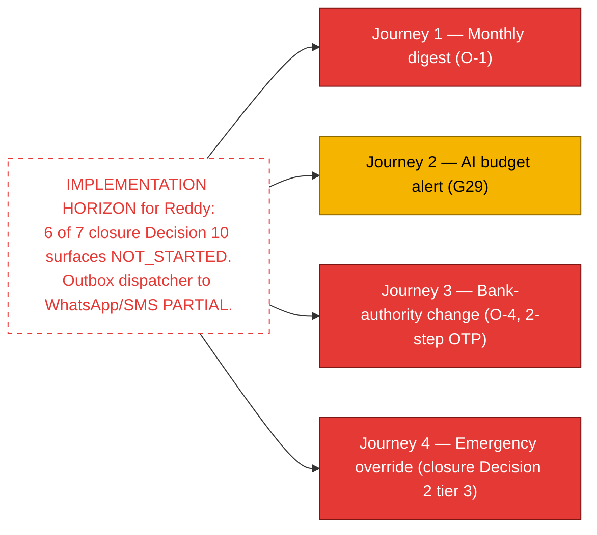

# Execution State — Owner (Reddy)

**Persona:** O.1 Mr. Reddy — founder/owner of Surya Cleaning. Not a daily product user. Receives digests, approves bank changes, watches company KPIs, fields AI budget alerts. Telugu first; reads English. Persona detail: `~/.claude/plans/now-i-think-it-functional-kernighan.md` §O.1. Audit: `docs/audits/2026-05-15-1yr-sim-owner-reddy.md`.

**Surface mapping:** Owner surfaces live in `apps/admin-web/app/owner/` (one `page.tsx` today) + WhatsApp digest delivery (off-app). Per closure Decision 10: 7 owner surfaces total — 4 admin-web + 3 off-app. Of those 7, **1** has any code today (`apps/admin-web/app/owner/page.tsx`).

## Build-state summary (overview)

> **Workflow execution diagrams live in `handoff/workflow-maps/owner-reddy.md`.** This file is the build-state ledger.



Workflow tally for Reddy: 0 BUILT · 1 PARTIAL (G29 backend) · 11 NOT_STARTED. Only the `apps/admin-web/app/owner/page.tsx` stub exists.

For actual journey diagrams: see `handoff/workflow-maps/owner-reddy.md`.

## Current active slice affecting Reddy

**None.** No active slice touches Reddy's surfaces today.

## Known risks / drift watchouts

- **Owner surfaces are 1-of-7 built.** Closure Decision 10 freezes the 7; do not let future slices fall back to "we'll add an owner thing eventually" without a tracker row.
- **G29 AI budget alert has a backend cron + outbox topic** but the delivery channel (WhatsApp out / SMS / email) is partially specified — friend pre-launch deferred MSG91 webhook (per `feedback_must_do_before_or_after_launch.md`).
- **Emergency override tier 3** (closure Decision 2 — owner inherits at 72h) is the most consequential not-yet-built path. If HR is fully absent for 72h and owner has no surface to invoke, the fallback chain has a dead end.
- **Bank-authority UI** is a sensitive surface (2-step OTP per closure Decision 10). Don't ship without security review.

## Recent commits touching this persona

```
# No commits directly touching owner-facing surfaces during Layer 1.
# Backend audit-event catalogue includes OWNER_BUDGET_ALERT_DISPATCHED (already
# present pre-Layer-1) and Layer 1 added EMERGENCY_OVERRIDE_ACTIVATED to catalogue.
```

## Workflow rows

---

### A1 — Phone OTP login (Reddy first login)

- **Persona:** Owner (Reddy)
- **Design verdict:** WORKS
- **Implementation state:** PARTIAL
- **Verification state:** UNVERIFIED
- **What works now:** Same OTP auth backend; admin-web `/login` exists.
- **What does not work yet:** No owner-specific landing tutorial. `/owner/page.tsx` exists but contents minimal.
- **Files / tests / commit refs:** `apps/admin-web/app/login/`, `apps/admin-web/app/owner/page.tsx`.
- **Current owner / current slice:** none
- **Next required step:** Closure Decision 10 — owner landing.

---

### B5 — Site creation (Reddy one-time setup approval)

- **Persona:** Owner (Reddy)
- **Design verdict:** WORKS
- **Implementation state:** NOT_STARTED
- **Verification state:** UNVERIFIED
- **What works now:** —
- **What does not work yet:** No owner approval gate on site creation. Sites currently HR-only.
- **Files / tests / commit refs:** —
- **Current owner / current slice:** none
- **Next required step:** Decide whether owner has approval gate; if yes, design.

---

### O-1 — Monthly digest (auto-composed, Telugu + English)

- **Persona:** Owner (Reddy)
- **Design verdict:** WORKS (closure Decision 10)
- **Implementation state:** NOT_STARTED
- **Verification state:** UNVERIFIED
- **What works now:** Digest table exists (`apps/backend/test/digest-persistence.test.ts` verified). DigestKind enum includes `owner_monthly`.
- **What does not work yet:** No composer. No WhatsApp dispatch. No admin-web detail view. No language toggle.
- **Files / tests / commit refs:** Backend: `packages/shared-schema/src/zod/digest.ts`.
- **Current owner / current slice:** none
- **Next required step:** DigestComposer service + WhatsApp dispatcher + admin-web monthly view.

---

### O-2 — Annual digest

- **Persona:** Owner (Reddy)
- **Design verdict:** WORKS
- **Implementation state:** NOT_STARTED
- **Verification state:** UNVERIFIED
- **What works now:** DigestKind enum includes `owner_annual`.
- **What does not work yet:** Composer + dispatch + UI.
- **Files / tests / commit refs:** —
- **Current owner / current slice:** none
- **Next required step:** Same as O-1, scoped to annual.

---

### O-3 — Incident digest (e.g., spike-in-complaints)

- **Persona:** Owner (Reddy)
- **Design verdict:** WORKS
- **Implementation state:** NOT_STARTED
- **Verification state:** UNVERIFIED
- **What works now:** DigestKind enum includes `owner_incident`.
- **What does not work yet:** Trigger logic (when does an incident digest fire?). Composer. Dispatch.
- **Files / tests / commit refs:** —
- **Current owner / current slice:** none
- **Next required step:** Design trigger thresholds → composer + dispatch.

---

### O-4 — Bank-authority UI (2-step OTP)

- **Persona:** Owner (Reddy)
- **Design verdict:** WORKS (closure Decision 10)
- **Implementation state:** NOT_STARTED
- **Verification state:** UNVERIFIED
- **What works now:** —
- **What does not work yet:** No bank entity in schema. No bank-change route. No 2-step OTP path. No owner UI.
- **Files / tests / commit refs:** —
- **Current owner / current slice:** none
- **Next required step:** Schema + route + UI + security review before ship.

---

### O-5 — AI overage approval (founder pick F-P-5 pending)

- **Persona:** Owner (Reddy)
- **Design verdict:** Founder pick required (F-P-5)
- **Implementation state:** BLOCKED
- **Verification state:** UNVERIFIED
- **What works now:** —
- **What does not work yet:** Marketing language + commercial decision pending. Technical surface blocked on founder pick.
- **Files / tests / commit refs:** —
- **Current owner / current slice:** none
- **Next required step:** Founder pick F-P-5.

---

### O-6 — Compliance lookup by employee (legal events)

- **Persona:** Owner (Reddy)
- **Design verdict:** WORKS (closure Decision 10)
- **Implementation state:** NOT_STARTED
- **Verification state:** UNVERIFIED
- **What works now:** AuditEvent table preserves history; closure spec mentions records export at termination (Decision 5).
- **What does not work yet:** No owner-facing lookup-by-employee UI. No compliance export format.
- **Files / tests / commit refs:** —
- **Current owner / current slice:** none
- **Next required step:** Compliance UI + export formatter.

---

### O-7 — Annual review (auto-composed)

- **Persona:** Owner (Reddy)
- **Design verdict:** WORKS
- **Implementation state:** NOT_STARTED
- **Verification state:** UNVERIFIED
- **What works now:** —
- **What does not work yet:** No annual-review composer. No surface.
- **Files / tests / commit refs:** —
- **Current owner / current slice:** none
- **Next required step:** Composer + UI.

---

### D20 / E24 — Termination digest visibility

- **Persona:** Owner (Reddy)
- **Design verdict:** WORKS
- **Implementation state:** NOT_STARTED
- **Verification state:** UNVERIFIED
- **What works now:** AuditEvent emits TERMINATION_APPLIED.
- **What does not work yet:** No owner digest line item; no surface.
- **Files / tests / commit refs:** —
- **Current owner / current slice:** none
- **Next required step:** Roll into O-1 monthly composer.

---

### G29 — AI budget alert recipient

- **Persona:** Owner (Reddy)
- **Design verdict:** WORKS
- **Implementation state:** PARTIAL
- **Verification state:** REAL_DB (backend cron)
- **What works now:** `apps/backend/src/jobs/reset-ai-spend.ts` runs daily; outbox topic `owner.budget_alert` enqueued at thresholds; AuditEvent `OWNER_BUDGET_ALERT_DISPATCHED`. Test `owner-budget-outbox.test.ts` green.
- **What does not work yet:** Outbox dispatcher (Phase C) → WhatsApp / SMS not wired to actually reach Reddy's phone. AI alerts for non-English founder (per closure Decision 10 — plain-English narrative) not formatted yet.
- **Files / tests / commit refs:** Backend: `apps/backend/src/jobs/reset-ai-spend.ts`, `apps/backend/test/owner-budget-outbox.test.ts`.
- **Current owner / current slice:** none
- **Next required step:** Outbox dispatcher → MSG91 / WhatsApp + Telugu narrative.

---

### Emergency override (closure Decision 2 tier 3 — Owner inherits at 72h)

- **Persona:** Owner (Reddy)
- **Design verdict:** WORKS (explicit invocation, NOT auto-inheritance)
- **Implementation state:** NOT_STARTED
- **Verification state:** UNVERIFIED
- **What works now:** AuditEvent kind `EMERGENCY_OVERRIDE_ACTIVATED` catalogued.
- **What does not work yet:** No invocation surface. No tier-progression cron. No owner notification at the 72h threshold.
- **Files / tests / commit refs:** —
- **Current owner / current slice:** none
- **Next required step:** Cron framework + owner explicit-invocation surface.
