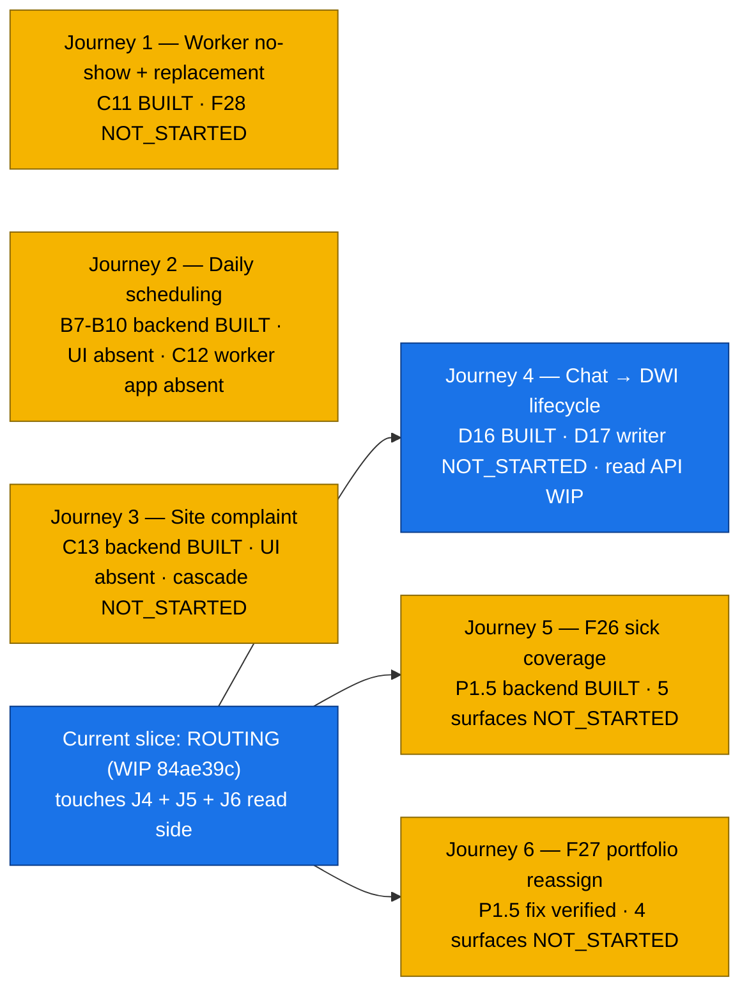

# Execution State — Supervisor (Ravi)

**Persona:** O.3 Ravi — supervisor at Surya Cleaning. Manages ~40 workers across ~8 sites at launch (envelope: 25–60 workers / 5–12 sites). Daily product user; spends most time inside the supervisor mobile app (`apps/mobile/`). Telugu first, Hindi second, basic English. ₹15K phone; relies on voice capture + clear cards. Persona detail: `~/.claude/plans/now-i-think-it-functional-kernighan.md` §O.3.

**Surface mapping:** Backend routes in `apps/backend/src/routes/`; supervisor screens in `apps/mobile/app/(auth)/` + `apps/mobile/app/(supervisor)/`. **No** worker-mobile or admin-web-supervisor-portal — the supervisor surface is mobile-only.

## Build-state summary (overview)

> **Workflow execution diagrams (the actual flowcharts) live in `handoff/workflow-maps/supervisor-ravi.md`.** This file is the build-state ledger; the journey layer is in workflow-maps.



Workflow tally for Ravi: 4 BUILT · 14 PARTIAL · 0 STUBBED · 4 NOT_STARTED · 3 WIP (D17/F26/F27 read side).

For actual journey diagrams with branches, handoffs, and implementation horizons: see `handoff/workflow-maps/supervisor-ravi.md`.

## Current active slice affecting Ravi

**Routing slice — paused mid-way.**

- Branch: `feat/layer-1-core-primitives`
- WIP commit: `84ae39c wip(routing): foundation read APIs — paused mid-slice for execution-state tracker`
- Touches rows: D17, F26, F27 (the read-time-routing path that surfaces PROPOSED DWIs to current responsible supervisor).
- Outstanding: 4th test file (`effective-responsibility-point-in-time.test.ts`) not written; real-DB verification not run.
- Resume condition: tracker accepted by friend → run real-DB → final test file → real-DB green → split WIP commit into 3 clean commits → surface.

## Known risks / drift watchouts

- **Supervisor mobile is half-built.** Auth + Chat + Profile screens are real; Today / Summary / Updates are stubs (`apps/mobile/app/(supervisor)/{today,summary,updates}.tsx`). Workflow rows that say "BUILT" or "PARTIAL" for backend often have stub UI — flagged per-row.
- **No DWI writers exist yet.** `grep -r supervisorDecision.create apps/backend/src` returns zero. D17 backend = PARTIAL because the table exists + the routing read API exists, but no extractor writes to it. Tests seed rows directly.
- **The routing slice is paused.** Until resumed and committed cleanly, the helper file in `apps/backend/src/lib/effective-responsibility.ts` is real and exported but not yet exercised against a real DB.
- **No `endedAt`-vs-`effectiveUntil` mistake propagation.** The friend's P1.5 finding (use `effectiveUntil` for planned supersession) was fixed. Any future binding-related work must respect this; check `apps/backend/src/lib/site-supervisor-binding.ts` reassign helper before touching binding lifecycle.

## Recent commits touching this persona

```
84ae39c wip(routing): foundation read APIs — paused mid-slice (D17, F26, F27)
44a453d fix(binding): permanent reassignment uses effectiveUntil, not endedAt (F26, F27)
fe0f6f4 test(binding): SiteSupervisorBinding real-DB lifecycle tests (F26, F27)
a8eed8b feat(audit): BINDING_* audit helpers + reassignPermanentBinding (F26, F27)
9c0b3d8 feat(schema): SiteSupervisorBinding table (F26, F27)
4bb9b2a test(schema): Notification + Digest + DWI.originContext + QueueItem view real-DB tests (D17 lineage)
ec40813 test(schema): HRPod + Policy + Membership.podId real-DB tests (no direct Ravi workflow)
f609749 feat(audit): typed audit-emit helpers + payload Zod schemas (D17 lineage)
095c766 feat(schema): Layer 1 core primitives (D17 lineage)
```

## Workflow rows

---

### A1 — Phone OTP login

- **Persona:** Supervisor (Ravi)
- **Design verdict:** WORKS
- **Implementation state:** BUILT
- **Verification state:** REAL_DB
- **What works now:** Backend `apps/backend/src/routes/auth.ts` issues OTP + verifies; bypass in dev via `AXHY_OTP_BYPASS=1`. Mobile screens `apps/mobile/app/(auth)/phone.tsx` + `otp.tsx` exist and work. JWT issued via `apps/backend/src/lib/jwt.ts`.
- **What does not work yet:** SMS dispatch in prod (MSG91 path) is gated on environment — verified locally with bypass; production webhook delivery is a launch task (per `feedback_must_do_before_or_after_launch.md`).
- **Files / tests / commit refs:** `apps/backend/src/routes/auth.ts`, `apps/mobile/app/(auth)/{phone,otp}.tsx`. Tests: existing auth + integration tests.
- **Current owner / current slice:** none — dormant
- **Next required step:** — (only if launch flips dev → prod SMS)

---

### A2 — JWT refresh + role select

- **Persona:** Supervisor (Ravi)
- **Design verdict:** WORKS
- **Implementation state:** BUILT
- **Verification state:** REAL_DB
- **What works now:** `issueAccessToken` + `issueRefreshToken` in `apps/backend/src/lib/jwt.ts`. Tenant context middleware reads claim. Multi-tenant invariant tests cover the path.
- **What does not work yet:** — (implicit lifecycle; no surfacing needed)
- **Files / tests / commit refs:** `apps/backend/src/lib/jwt.ts`, `apps/backend/src/middleware/tenant-context.ts`, `apps/backend/test/cross-tenant-isolation.test.ts`.
- **Current owner / current slice:** none
- **Next required step:** —

---

### A3 — Worker invitation → activation (Ravi acknowledges new worker)

- **Persona:** Supervisor (Ravi)
- **Design verdict:** WORKS (per ops-workflow-model)
- **Implementation state:** PARTIAL
- **Verification state:** UNVERIFIED (from Ravi's seat)
- **What works now:** Backend worker creation route exists in `apps/backend/src/routes/workers.ts`. HR invites; worker activation lifecycle handled.
- **What does not work yet:** Ravi-side surface — no "new worker joined your portfolio" banner or list view in mobile. Today tab is a stub.
- **Files / tests / commit refs:** `apps/backend/src/routes/workers.ts`, `apps/backend/test/mark-absent.test.ts` (creates workers for tests).
- **Current owner / current slice:** none
- **Next required step:** Layer 2 — supervisor Today tab to surface new-worker events from outbox.

---

### A4 — Worker doc collection → ACTIVE (Ravi reminds)

- **Persona:** Supervisor (Ravi)
- **Design verdict:** WORKS
- **Implementation state:** PARTIAL
- **Verification state:** UNVERIFIED
- **What works now:** Worker state machine has DOC_PENDING → ACTIVE transition in `packages/state-machines/src/worker.ts`. Backend recognises state changes.
- **What does not work yet:** No supervisor-side reminder surface. Today tab stub. Worker app doesn't exist (so worker can't upload docs in-app yet).
- **Files / tests / commit refs:** `packages/state-machines/src/worker.ts`.
- **Current owner / current slice:** none
- **Next required step:** Layer 2 — supervisor surface + worker app activation.

---

### B5 — Site creation (Ravi views)

- **Persona:** Supervisor (Ravi)
- **Design verdict:** WORKS
- **Implementation state:** PARTIAL
- **Verification state:** UNVERIFIED
- **What works now:** Backend `Site` model + creation path (admin-only writes per `feedback_no_ai_suggestions_admin_decides.md`). Sites table queryable.
- **What does not work yet:** No supervisor-side "site list" surface. Sites not surfaced in mobile.
- **Files / tests / commit refs:** `packages/shared-schema/prisma/schema.prisma` (Site model), `apps/backend/src/routes/sites.ts`.
- **Current owner / current slice:** none
- **Next required step:** Layer 2 — supervisor sites overview tab.

---

### B6 — Site state transitions (Ravi sees in tab)

- **Persona:** Supervisor (Ravi)
- **Design verdict:** WORKS
- **Implementation state:** PARTIAL
- **Verification state:** UNVERIFIED
- **What works now:** Site.state column exists; 14-state machine named in schema comment.
- **What does not work yet:** State machine wiring is placeholder string; transitions not enforced. No supervisor visibility of site auto-suspension events.
- **Files / tests / commit refs:** `packages/shared-schema/prisma/schema.prisma` (Site.state).
- **Current owner / current slice:** none
- **Next required step:** State-machine implementation + push notification on cascade (Closure Decision 5 worker-side).

---

### B7 — Calendar entry creation (Ravi daily)

- **Persona:** Supervisor (Ravi)
- **Design verdict:** WORKS
- **Implementation state:** PARTIAL
- **Verification state:** REAL_DB (backend)
- **What works now:** Backend `POST /calendar` route in `apps/backend/src/routes/calendar.ts`; CalendarEntry model exists; tests pass.
- **What does not work yet:** No mobile screen for calendar entry creation. Today + Summary tabs stub.
- **Files / tests / commit refs:** `apps/backend/src/routes/calendar.ts`, `apps/backend/test/calendar-promote.test.ts`.
- **Current owner / current slice:** none
- **Next required step:** Layer 2 — calendar entry creation UI.

---

### B8 — Calendar → Assignment promotion (Ravi daily)

- **Persona:** Supervisor (Ravi)
- **Design verdict:** WORKS
- **Implementation state:** PARTIAL
- **Verification state:** REAL_DB (backend)
- **What works now:** `POST /calendar/:id/promote` in `apps/backend/src/routes/calendar.ts`; integration test green.
- **What does not work yet:** No mobile UI to invoke promotion.
- **Files / tests / commit refs:** `apps/backend/src/routes/calendar.ts`, `apps/backend/test/calendar-promote.test.ts`.
- **Current owner / current slice:** none
- **Next required step:** Layer 2 — promote button in supervisor calendar surface.

---

### B9 — Direct assignment creation (Ravi daily)

- **Persona:** Supervisor (Ravi)
- **Design verdict:** WORKS
- **Implementation state:** PARTIAL
- **Verification state:** REAL_DB (backend)
- **What works now:** `apps/backend/src/routes/assignments.ts` creates assignments; conflict guard wired (sprint 9/10).
- **What does not work yet:** No supervisor-side direct-assignment UI (chat-driven path works via D16/D17 — see those rows).
- **Files / tests / commit refs:** `apps/backend/src/routes/assignments.ts`, `apps/backend/test/assignment-create.test.ts`.
- **Current owner / current slice:** none
- **Next required step:** Layer 2 — direct assignment screen, OR fold into chat extraction (D16).

---

### B10 — Conflict detection at assignment (Ravi catches conflicts)

- **Persona:** Supervisor (Ravi)
- **Design verdict:** WORKS
- **Implementation state:** BUILT
- **Verification state:** REAL_DB
- **What works now:** Overlap-guard from sprint 9/10 prevents conflicting assignments at insert time. Race fix shipped in v1.8.0 (per memory). Chat flow surfaces conflicts via DecisionCard.
- **What does not work yet:** —
- **Files / tests / commit refs:** `apps/backend/src/routes/assignments.ts`, `apps/backend/test/assignment-create.test.ts`, `apps/backend/test/assignment-trigger.test.ts`.
- **Current owner / current slice:** none
- **Next required step:** —

---

### C11 — Mark worker absent (Ravi daily)

- **Persona:** Supervisor (Ravi)
- **Design verdict:** WORKS
- **Implementation state:** PARTIAL
- **Verification state:** REAL_DB (backend)
- **What works now:** `POST /workers/:id/mark-absent` route in `apps/backend/src/routes/workers.ts`; AuditEvent emitted; pay-deduct math correct; integration test `mark-absent.test.ts` green.
- **What does not work yet:** Supervisor mobile UI to mark absent — chat-driven path works (utter "Mukesh didn't come" → DecisionCard → Apply). Direct button absent.
- **Files / tests / commit refs:** `apps/backend/src/routes/workers.ts`, `apps/backend/test/mark-absent.test.ts`.
- **Current owner / current slice:** none
- **Next required step:** Layer 2 — Today tab mark-absent button + chat extraction for the kind (extractor work is D16/D17).

---

### C12 — Visit lifecycle (Ravi reviews flagged)

- **Persona:** Supervisor (Ravi)
- **Design verdict:** WORKS for happy path; CONFUSING for mid-visit flag (per audits §5.4)
- **Implementation state:** PARTIAL
- **Verification state:** REAL_DB (END-visit path)
- **What works now:** Visit model + 12-state machine in `packages/state-machines/src/visit.ts`. `POST /visits/:id/end` route exists with AuditEvent + outbox `ai.verify` enqueue.
- **What does not work yet:** Worker side does not exist (no worker-mobile to start/end). Supervisor flagged-visit review surface absent. AI verification surface (Phase C) deferred per `apps/backend/src/routes/visits.ts` header.
- **Files / tests / commit refs:** `apps/backend/src/routes/visits.ts`, `packages/state-machines/src/visit.ts`.
- **Current owner / current slice:** none
- **Next required step:** Layer 2 — worker app start/end + supervisor flagged-review surface.

---

### C13 — Site complaint logging (Ravi logs them)

- **Persona:** Supervisor (Ravi)
- **Design verdict:** WORKS
- **Implementation state:** PARTIAL
- **Verification state:** REAL_DB (backend)
- **What works now:** `POST /sites/:id/complaints` in `apps/backend/src/routes/sites.ts`. AuditEvent + outbox `hr.complaint_persisted`. Integration test `log-complaint.test.ts` green.
- **What does not work yet:** No supervisor mobile complaint-log UI. Chat flow not yet wired for complaint extraction.
- **Files / tests / commit refs:** `apps/backend/src/routes/sites.ts`, `apps/backend/test/log-complaint.test.ts`.
- **Current owner / current slice:** none
- **Next required step:** Layer 2 — complaint-log button on supervisor site detail surface OR chat extraction wiring.

---

### C14 — Visit photo verification (Ravi resolves flags)

- **Persona:** Supervisor (Ravi)
- **Design verdict:** WORKS for post-visit; MISSING for mid-visit (audit §5.4)
- **Implementation state:** PARTIAL
- **Verification state:** UNVERIFIED
- **What works now:** Visit table has `flagged` bit; VisitPhoto model exists. Outbox `ai.verify` enqueued at visit end.
- **What does not work yet:** AI verification dispatcher handler is Phase C placeholder. No supervisor surface for flagged review (FlaggedReviewSheet absent). pHash dedupe shipped in v1.8.0 backend-side.
- **Files / tests / commit refs:** `apps/backend/src/routes/visits.ts`, `packages/shared-schema/prisma/schema.prisma` (Visit.flagged + VisitPhoto).
- **Current owner / current slice:** none
- **Next required step:** Phase C wave 5 — AI verify dispatcher + supervisor flagged-review surface.

---

### C15 — Audit reversal (30-min undo)

- **Persona:** Supervisor (Ravi)
- **Design verdict:** DRIFT (R6 vs D.1 specs disagree on 30 vs 5 min — F-P-4 founder pick pending per closure §12)
- **Implementation state:** NOT_STARTED
- **Verification state:** UNVERIFIED
- **What works now:** —
- **What does not work yet:** No reversal route. No supervisor undo UI. Founder pick (F-P-4) not yet locked.
- **Files / tests / commit refs:** —
- **Current owner / current slice:** none
- **Next required step:** Founder pick on reverse window (F-P-4) → backend reversal route → mobile undo affordance.

---

### D16 — AI chat → decision extraction (Ravi daily)

- **Persona:** Supervisor (Ravi)
- **Design verdict:** WORKS
- **Implementation state:** BUILT
- **Verification state:** REAL_DB
- **What works now:** Full chat pipeline: voice-via-iOS-dictation → POST /chat/messages → AI extraction → DecisionCard → tap Apply (Wave 4a MVP). `apps/mobile/app/(supervisor)/chat.tsx` + backend `apps/backend/src/routes/chat.ts`. LivingDoc moat shipped (wave 4b phase 2). Tests `chat-tool-loop.test.ts`, `chat-swap.test.ts`, `cross-tenant-chat.test.ts` green.
- **What does not work yet:** Extractor does NOT write SupervisorDecision rows (D17). DecisionCard → Apply currently goes directly to domain mutation (Assignment.create, Worker absence, etc.) WITHOUT a PROPOSED-row intermediate. That's the D17 gap below.
- **Files / tests / commit refs:** `apps/backend/src/routes/chat.ts`, `apps/mobile/app/(supervisor)/chat.tsx`, `apps/backend/test/chat-*.test.ts`.
- **Current owner / current slice:** none
- **Next required step:** —

---

### D17 — Decision apply (PROPOSED → APPLIED)

- **Persona:** Supervisor (Ravi)
- **Design verdict:** WORKS
- **Implementation state:** PARTIAL
- **Verification state:** UNVERIFIED (read API LOCAL; full pipeline not exercised)
- **What works now:** SupervisorDecision schema + originContext + proposedDuringAbsence columns shipped (Layer 1). Read API `GET /decisions/proposed-for-me` (paused WIP at `84ae39c`) routes PROPOSED rows by current responsibility — helpers + route exist.
- **What does not work yet:** **No SupervisorDecision writers exist.** `grep -r supervisorDecision.create` = 0 matches. Chat extraction writes DecisionCards in-memory + applies directly; no PROPOSED row is persisted. So the read API has nothing to return today other than test-seeded rows. The "PROPOSED → APPLIED" lifecycle is fully unimplemented at the writer side.
- **Files / tests / commit refs:** `apps/backend/src/lib/effective-responsibility.ts` (WIP @84ae39c), `apps/backend/src/routes/decisions.ts` (WIP @84ae39c), `apps/backend/test/decisions-proposed-for-me-route.test.ts` (WIP @84ae39c).
- **Current owner / current slice:** Routing slice paused @84ae39c — Claude resumes after tracker accepted.
- **Next required step:** (a) finish routing slice (resume); (b) separate slice: chat extractor writes SupervisorDecision PROPOSED rows; (c) Apply endpoint flips appliedAt + executes domain mutation.

---

### D18 — Decision dismiss / undo

- **Persona:** Supervisor (Ravi)
- **Design verdict:** MISSING (dismiss has no reason capture per audit)
- **Implementation state:** NOT_STARTED
- **Verification state:** UNVERIFIED
- **What works now:** —
- **What does not work yet:** No dismiss route. No undo. Audit gap surfaced.
- **Files / tests / commit refs:** —
- **Current owner / current slice:** none
- **Next required step:** After D17 writer lands — add dismiss endpoint + reason capture.

---

### D19 — Option-picker decision

- **Persona:** Supervisor (Ravi)
- **Design verdict:** CONFUSING (design hides reasoning per audit)
- **Implementation state:** NOT_STARTED
- **Verification state:** UNVERIFIED
- **What works now:** —
- **What does not work yet:** No option picker UI; no backend support for n-way choice DWIs.
- **Files / tests / commit refs:** —
- **Current owner / current slice:** none
- **Next required step:** After D17 — extend DWI payload schema + add picker UI.

---

### D20 — EMPLOYMENT-tier ack (Ravi proposes)

- **Persona:** Supervisor (Ravi)
- **Design verdict:** WORKS (closure §5.3.9 + Decision 7) — author-side; HR ack gate is Kavitha's row
- **Implementation state:** PARTIAL
- **Verification state:** REAL_DB (schema)
- **What works now:** SupervisorDecision.originContext + proposedDuringAbsence columns shipped + tested (commits `095c766`, `4bb9b2a`). Schema supports proposer-side context capture.
- **What does not work yet:** No supervisor UI to propose termination directly (chat surfaces `WORKER_TERMINATION_REQUESTED` AuditEvent but no SupervisorDecision row writes). HR ack screen doesn't exist (Kavitha row also PARTIAL).
- **Files / tests / commit refs:** `apps/backend/test/supervisor-decision-origin-context.test.ts`, `packages/shared-schema/prisma/schema.prisma` (SupervisorDecision).
- **Current owner / current slice:** none
- **Next required step:** D17 writer slice + HR ack surface (Kavitha side).

---

### E21 — Leave request workflow (Ravi sees cascade)

- **Persona:** Supervisor (Ravi)
- **Design verdict:** BROKEN at scale (HR queue overload — audit Month 6)
- **Implementation state:** PARTIAL
- **Verification state:** REAL_DB (backend)
- **What works now:** `apps/backend/src/routes/leave-requests.ts` create + state transitions. LeaveRequest model. SLA tiers locked in closure spec but not yet wired.
- **What does not work yet:** No supervisor "you've got an HR-queued leave decision waiting" surface. HR queue SLA + escalation not implemented.
- **Files / tests / commit refs:** `apps/backend/src/routes/leave-requests.ts`.
- **Current owner / current slice:** none
- **Next required step:** Layer 2 — supervisor cascade surface; SLA wiring (Layer 2 also).

---

### E22 — Worker swap request (Ravi initiates)

- **Persona:** Supervisor (Ravi)
- **Design verdict:** MISSING (bilateral acceptance not designed per audit)
- **Implementation state:** PARTIAL
- **Verification state:** REAL_DB (backend)
- **What works now:** `apps/backend/src/routes/swap-requests.ts` initiation. SwapRequest 12-state machine in `packages/state-machines/src/swap-request.ts`.
- **What does not work yet:** Bilateral acceptance (toWorker accepts/rejects) not designed in workflow — requires worker app + decision flow. Audit Month 6.5 surfaced this as MISSING.
- **Files / tests / commit refs:** `apps/backend/src/routes/swap-requests.ts`.
- **Current owner / current slice:** none
- **Next required step:** Founder/friend design pass on bilateral acceptance + worker app.

---

### E23 — HR Update post (Ravi acks)

- **Persona:** Supervisor (Ravi)
- **Design verdict:** WORKS (5-word ack workflow) — but BROKEN at 5K scale (audit Week 3 — feed noise)
- **Implementation state:** PARTIAL
- **Verification state:** UNVERIFIED
- **What works now:** HRUpdate entity exists; POST /hr-updates route stubbed per closure-spec Phase 1 findings. Audience model is supervisor-only at launch (per closure §7 amendment for pay-affecting).
- **What does not work yet:** POST route fully wired? Need to verify. Updates tab in supervisor mobile is STUBBED — no surface to ack. Filter / search / per-site routing not yet built.
- **Files / tests / commit refs:** `apps/backend/src/routes/` (HR Updates partial), `apps/mobile/app/(supervisor)/updates.tsx` (stub).
- **Current owner / current slice:** none
- **Next required step:** Layer 2 — supervisor Updates tab UI + finish backend POST route.

---

### E24 — Worker termination (Ravi proposes)

- **Persona:** Supervisor (Ravi)
- **Design verdict:** MISSING (proposer-side wait visibility per audit Month 7)
- **Implementation state:** PARTIAL
- **Verification state:** UNVERIFIED
- **What works now:** Worker state machine has ACTIVE → TERMINATION_PENDING transition. `apps/backend/src/routes/chat.ts` line 786 emits AuditEvent `WORKER_TERMINATION_REQUESTED` when supervisor utters termination intent through chat.
- **What does not work yet:** No SupervisorDecision row written. No HR ack screen. No "while you wait" visibility for the proposer. The actual kind string for SupervisorDecision termination isn't locked.
- **Files / tests / commit refs:** `apps/backend/src/routes/chat.ts:786`, `packages/state-machines/src/worker.ts`.
- **Current owner / current slice:** none
- **Next required step:** Pick the SupervisorDecision kind name for termination → D17 writer → HR ack flow → proposer-wait surface.

---

### E25 — Worker suspension / block (Ravi proposes)

- **Persona:** Supervisor (Ravi)
- **Design verdict:** MISSING (suspension return-date not surfaced — audit Month 6.5)
- **Implementation state:** NOT_STARTED
- **Verification state:** UNVERIFIED
- **What works now:** —
- **What does not work yet:** No suspension state or route in worker / domain code.
- **Files / tests / commit refs:** —
- **Current owner / current slice:** none
- **Next required step:** Spec gap — design the suspension lifecycle first (return date, audience).

---

### F26 — Acting supervisor coverage (Ravi gets sick, Lakshmi covers)

- **Persona:** Supervisor (Ravi)
- **Design verdict:** WORKS (Decision 4 — closure spec)
- **Implementation state:** PARTIAL
- **Verification state:** REAL_DB
- **What works now:** P1.5 SiteSupervisorBinding table shipped + verified (commits `9c0b3d8`, `a8eed8b`, `fe0f6f4`, `44a453d`). EXCLUDE no-overlap invariant; ACTING + PERMANENT discriminator; CHECK constraints. Audit helpers `recordBindingCreated` + `recordBindingEndedManual`. Read API `getEffectiveBinding` (WIP @84ae39c) returns acting-over-permanent precedence. 18/18 binding tests green.
- **What does not work yet:** No HR write surface to create an acting binding (Kavitha row H-1 — admin-web HR portal not built). No supervisor-side "while you were out" digest surface (closure Decision 4 — UX deferred). No worker-side `WORKER_SUPERVISOR_CHANGE_NOTIFIED` push (worker app doesn't exist). DWI routing across binding-switch (writer side) not yet wired (D17 row).
- **Files / tests / commit refs:** `packages/shared-schema/prisma/migrations/20260516_p1_5_site_supervisor_binding/`, `apps/backend/src/lib/site-supervisor-binding.ts`, `apps/backend/test/binding-*.test.ts`.
- **Current owner / current slice:** Routing slice (paused @84ae39c) covers F26 from Ravi's read-side.
- **Next required step:** Finish routing slice → HR portal slice (Kavitha) → worker notification (worker app).

---

### F27 — Permanent portfolio reassignment (Ravi hands sites to Anjali)

- **Persona:** Supervisor (Ravi)
- **Design verdict:** MISSING (portfolio-delta surface absent — audit Month 9/11)
- **Implementation state:** PARTIAL
- **Verification state:** REAL_DB
- **What works now:** `reassignPermanentBinding` service helper (`apps/backend/src/lib/site-supervisor-binding.ts`) atomically ends old via `effectiveUntil` (not endedAt) + creates new + emits both audit events. Supports future-dated cutover (P1.5 fix `44a453d`). Tests cover all 4 scenarios.
- **What does not work yet:** HR write surface (Kavitha). No supervisor "your portfolio shrank by 3 sites" delta digest. Activity-tab continuity across reassignment is not wired (depends on D17 read-time routing + activity surface).
- **Files / tests / commit refs:** `apps/backend/src/lib/site-supervisor-binding.ts`, `apps/backend/test/binding-permanent-reassignment-basics.test.ts`.
- **Current owner / current slice:** Routing slice @84ae39c covers F27 from Ravi's read side.
- **Next required step:** HR write surface + supervisor portfolio-delta digest.

---

### F28 — Replacement invite (Ravi initiates daily)

- **Persona:** Supervisor (Ravi)
- **Design verdict:** WORKS (lifecycle locked in D.1 + ops §7.9)
- **Implementation state:** NOT_STARTED
- **Verification state:** UNVERIFIED
- **What works now:** —
- **What does not work yet:** No backend route. No mobile UI. Lifecycle states cataloged but not implemented.
- **Files / tests / commit refs:** —
- **Current owner / current slice:** none
- **Next required step:** Design wave 5 — replacement invite flow (worker-app dependent).
