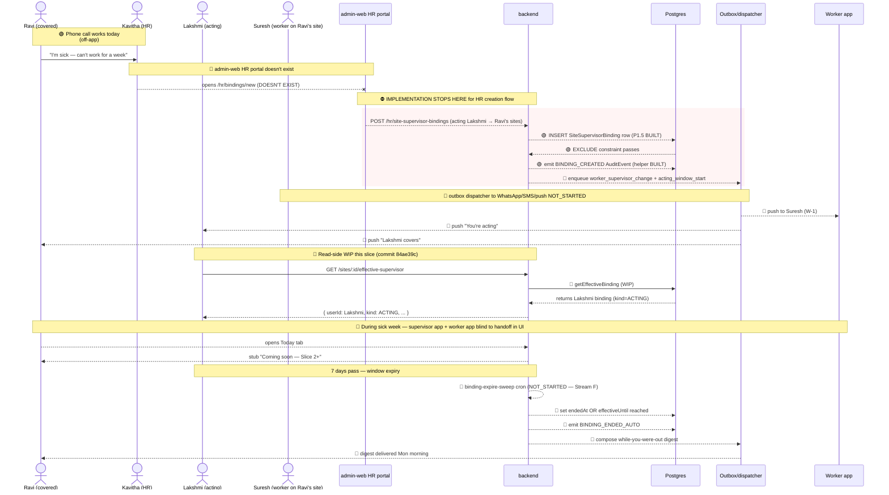
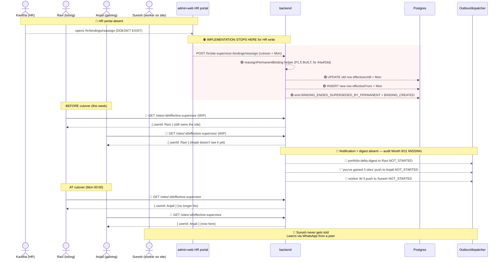
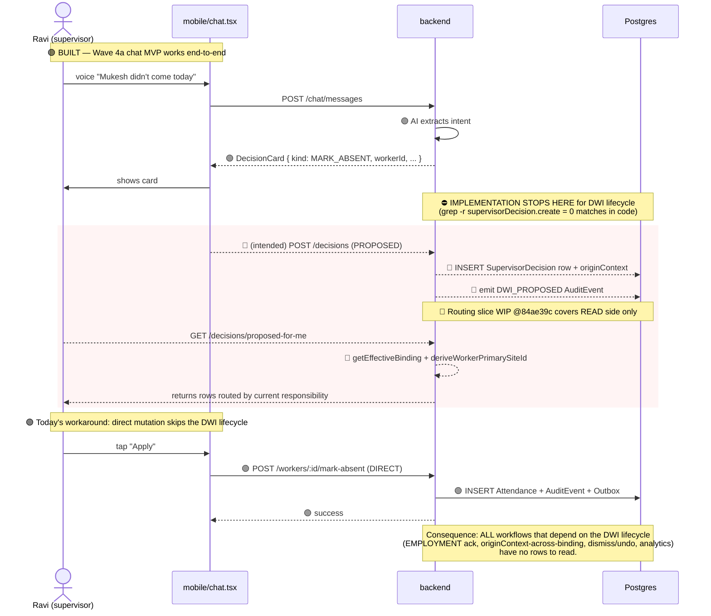
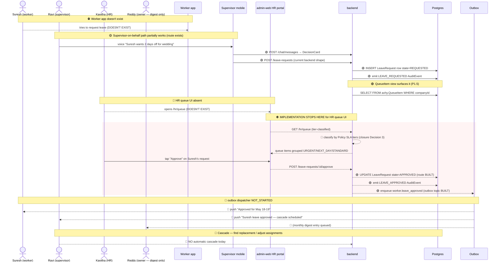
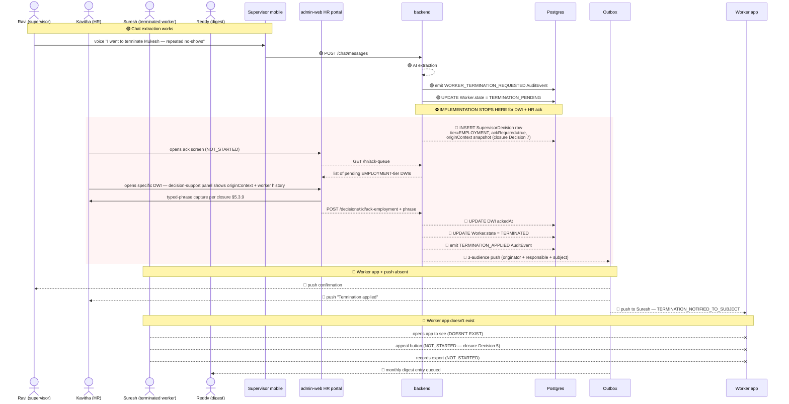

# Workflow Maps — Combined / Cross-Persona End-to-End

> **Layer 2 — system flow architecture.** This is the load-bearing artifact for "does Supervisor / Worker / HR / Owner line up together?" Each sequence diagram shows every participating persona + backend + outbox, with the implementation horizon marked explicitly.
>
> Reads alongside `execution-state/combined.md` (which tracks the build-state roll-up). Diagrams here show the INTENDED end-to-end flow; horizon markers show where it actually stops today.
>
> Spec lineage: closure spec §3–9; responsibility-model §5.5–5.9; ops-workflow-model §6 + §12; the 5 audit drafts in `axhy-v3/docs/audits/`.

## Reading conventions

- 🟢 = step is BUILT today
- 🟡 = step is PARTIAL
- 🔵 = step is WIP this slice
- ⛔ = IMPLEMENTATION STOPS HERE — everything below this point is intended but not coded
- 🔴 = step is NOT_STARTED
- Dashed arrows after ⛔ = "spec says this should happen"

## Sequence 1 — F26 Acting cover (Ravi sick, Lakshmi covers for 7 days)

The headline P1.5 workflow. Friend's audit Month 8.



**Where it really stops today:** the helper + audit-emit layer is built and verified. Everything above the routing read API is unbuilt: HR portal, dispatcher, worker push, cron. 5 surfaces gate end-to-end.

---

## Sequence 2 — F27 Permanent reassignment (future-dated handoff)

Q3 rebalance. Anjali takes 3 of Ravi's sites starting Monday.



**Where it really stops today:** mechanism BUILT (P1.5 fix is verified). Notification + digest surfaces NOT_STARTED.

---

## Sequence 3 — D17 Decision apply (the missing-middle)

The chat MVP path works but skips the DWI lifecycle entirely. Closure spec requires it.



**This is the largest single workflow gap.** Schema BUILT; writer NOT_STARTED; routing read API WIP.

---

## Sequence 4 — E21 Leave request end-to-end

Suresh → HR queue → approval → all parties notified.



---

## Sequence 5 — E24 Worker termination end-to-end

Ravi proposes → Kavitha types phrase → applied → Suresh notified.



**Audit verdict:** `BROKEN` — Suresh's most consequential moment is entirely offline.

---

## Sequence 6 — Overlap stress scene (audit Round 5 combined)

Multiple workflows fire the same morning. The classic "monsoon Tuesday" stress test.

```mermaid
sequenceDiagram
    actor Ravi as Ravi
    actor Lakshmi as Lakshmi (acting for Anil — different supervisor)
    actor Kavitha as Kavitha (HR)
    participant BE as backend
    participant DB as Postgres
    participant OBX as Outbox

    par 3 workers no-show simultaneously
        Ravi->>BE: 🟢 mark-absent Worker A
        Ravi->>BE: 🟢 mark-absent Worker B
        Ravi->>BE: 🟢 mark-absent Worker C
    and Kavitha creates new acting binding for another supervisor
        Kavitha->>BE: 🔴 POST /hr/bindings (acting Lakshmi for Anil)
        BE->>DB: 🟢 INSERT binding (P1.5 EXCLUDE prevents overlap)
    and Permanent reassignment cutover scheduled for tomorrow
        BE->>BE: 🟢 helper already wrote both rows; cutover tomorrow
    end

    Note over BE,DB: 🟢 EXCLUDE invariant holds across all 3 concurrent ops<br/>(P1.5 tests prove this)

    Note over BE,OBX: ⛔ Burst handling — closure Decision 9 NOT_STARTED
    rect rgba(255,200,200,0.2)
    BE-->>OBX: 🔴 coalesce 3 mark-absent events into one supervisor digest
    BE-->>BE: 🔴 AI backlog throttling chip ('Processing...')
    BE-->>BE: 🔴 global busy banner if company-wide burst detected
    end

    Note over Lakshmi,BE: 🔵 Routing slice would handle this read side correctly
    Lakshmi->>BE: GET /decisions/proposed-for-me
    BE-->>BE: 🔵 deriveWorkerPrimarySiteId for each worker
    BE-->>BE: 🔵 getEffectiveBinding for each site
    BE-->>Lakshmi: 🔵 only Anil's sites' decisions surface (correct routing)

    Note over Kavitha,DB: 🟢 Concurrent HR writes by 2+ users — DB serializes
    Note over Kavitha,DB: 🔴 But: queue lock + cross-pod override flow NOT_STARTED
```

**What works under burst today:** the DB-level invariants (EXCLUDE, CHECK constraints, FKs). What doesn't: coalescing, AI throttling, queue locks, multi-HR-user coordination.

---

## Cross-persona summary verdict (mid-2026-05-15)

| Workflow               | End-to-end status                                                                                         |
| ---------------------- | --------------------------------------------------------------------------------------------------------- |
| F26 acting cover       | 1 of 5 surfaces wired (backend + routing WIP). HR / dispatcher / worker push / cron / digest all missing. |
| F27 permanent reassign | Mechanism 100% verified. 0 of 4 surfaces wired.                                                           |
| D17 decision apply     | Writer 0%. Reader WIP. Schema 100%.                                                                       |
| E21 leave request      | Backend 80%. HR queue UI 0%. Worker app 0%. SLA wiring 0%.                                                |
| E24 termination        | Backend partial (AuditEvent only). DWI writer 0%. HR ack 0%. Worker app 0%. Appeal 0%. Export 0%.         |
| Overlap stress         | DB invariants 100%. Coalescing / throttling 0%. Queue lock 0%.                                            |

The pattern is consistent: **backend is done or nearly done. Surfaces are not.** This is the right state for Layer 1 — but the gap will be the entire Layer 2 lift.
