# Workflow Maps — Data Model

> **Layer 2 — the "under the hood" view.** How the 23 axhy tables connect via foreign keys + how each workflow reads / writes / audit-emits across them.
>
> Reads alongside `packages/shared-schema/prisma/schema.prisma` (the source). Diagrams are derived from the live schema; tables-by-workflow matrix is derived from the routes + audit kinds shipped today.
>
> Spec lineage: `packages/shared-schema/prisma/schema.prisma`; ADR-0003 (single source of truth for schema); closure spec §3 (the 6 primitives); responsibility-model §7 (binding shape).

## Lifecycle layers

Grouping tables by the role they play. Three layers from inside out:

- **Identity** — `Company`, `User`, `Membership`, `OtpAttempt` — who is using the system + tenant scoping.
- **Operational** — `Worker`, `Site`, `Assignment`, `CalendarEntry`, `Visit`, `VisitPhoto`, `Attendance`, `LeaveRequest`, `Complaint`, `SwapRequest`, `SupervisorDecision`, `LivingDoc`, `HRUpdate`, `ChatThread`, `ChatMessage`, `ChatRequestLog` — the business state.
- **Responsibility (P1.5)** — `SiteSupervisorBinding`, `HRPod` — who is currently responsible.
- **Observability + delivery** — `AuditEvent`, `Outbox`, `Notification`, `Digest`, `Policy`, `Device` — what happened, what should be delivered, what was configured.

## ER diagram

```mermaid
erDiagram
    Company ||--o{ User : "companyId, ON DELETE SET NULL"
    Company ||--o{ Membership : "companyId, ON DELETE CASCADE"
    Company ||--o{ Site : "companyId, ON DELETE CASCADE"
    Company ||--o{ Worker : "companyId, ON DELETE CASCADE"
    Company ||--o{ Visit : "companyId, ON DELETE CASCADE"
    Company ||--o{ LeaveRequest : "companyId, ON DELETE CASCADE"
    Company ||--o{ Attendance : "companyId, ON DELETE CASCADE"
    Company ||--o{ Complaint : "companyId, ON DELETE CASCADE"
    Company ||--o{ SwapRequest : "companyId, ON DELETE CASCADE"
    Company ||--o{ SupervisorDecision : "companyId, ON DELETE CASCADE"
    Company ||--o{ Assignment : "companyId, ON DELETE CASCADE"
    Company ||--o{ CalendarEntry : "companyId, ON DELETE CASCADE"
    Company ||--o{ ChatThread : "companyId, ON DELETE CASCADE"
    Company ||--o{ HRUpdate : "companyId, ON DELETE CASCADE"
    Company ||--o{ LivingDoc : "companyId, ON DELETE CASCADE"
    Company ||--o{ AuditEvent : "companyId, ON DELETE CASCADE"
    Company ||--o{ Outbox : "companyId, ON DELETE CASCADE"
    Company ||--o{ Device : "companyId, ON DELETE CASCADE"
    Company ||--o{ HRPod : "companyId, ON DELETE CASCADE (P1.5)"
    Company ||--o{ Policy : "companyId, ON DELETE CASCADE (P1.5)"
    Company ||--o{ Notification : "companyId, ON DELETE CASCADE (P1.5)"
    Company ||--o{ Digest : "companyId, ON DELETE CASCADE (P1.5)"
    Company ||--o{ SiteSupervisorBinding : "companyId, ON DELETE CASCADE (P1.5)"

    User ||--o{ Membership : "userId, ON DELETE CASCADE"
    User ||--o{ Device : "userId, ON DELETE CASCADE"
    User ||--o| Worker : "userId (Worker.userId UNIQUE), nullable"
    User ||--o{ SiteSupervisorBinding : "userId (responsible)"
    User ||--o{ SiteSupervisorBinding : "actingForUserId (covered)"
    User ||--o{ HRPod : "primaryOwnerUserId"
    User ||--o{ HRPod : "backupOwnerUserId nullable"

    Membership }o--|| HRPod : "podId nullable (HR pods only)"

    Site ||--o{ Visit : "siteId, ON DELETE CASCADE"
    Site ||--o{ Complaint : "siteId, ON DELETE CASCADE"
    Site ||--o{ SwapRequest : "siteId, ON DELETE CASCADE"
    Site ||--o{ Assignment : "siteId, ON DELETE CASCADE"
    Site ||--o{ SiteSupervisorBinding : "siteId, ON DELETE CASCADE"

    Worker ||--o{ Visit : "workerId, ON DELETE CASCADE"
    Worker ||--o{ LeaveRequest : "workerId, ON DELETE CASCADE"
    Worker ||--o{ Attendance : "workerId, ON DELETE CASCADE"
    Worker ||--o{ SwapRequest : "fromWorkerId"
    Worker ||--o{ SwapRequest : "toWorkerId"
    Worker ||--o{ Assignment : "workerId, ON DELETE CASCADE"

    Visit ||--o{ VisitPhoto : "visitId, ON DELETE CASCADE"
    Visit ||--o| Visit : "correctsVisitId / originalVisitId (chain)"

    ChatThread ||--o{ ChatMessage : "threadId"
    ChatMessage ||--o{ ChatRequestLog : "messageId nullable"

    Company {
        uuid id PK
        string name
        string slug UK
        string ownerPhone
        string ownerName
        decimal aiSpendDailyInr
    }
    User {
        uuid id PK
        string phone UK
        string locale
        uuid companyId FK
    }
    Membership {
        uuid id PK
        uuid companyId FK
        uuid userId FK
        string role "WORKER/SUPERVISOR/OWNER/HR/SUPER_ADMIN"
        uuid podId FK "P1.5 HR-only"
    }
    HRPod {
        uuid id PK
        uuid companyId FK
        string name
        uuid primaryOwnerUserId
        uuid backupOwnerUserId
    }
    SiteSupervisorBinding {
        uuid id PK
        uuid companyId FK
        uuid siteId FK
        uuid userId FK "responsible supervisor"
        uuid actingForUserId FK "NULL=permanent, else acting"
        timestamptz effectiveFrom
        timestamptz effectiveUntil "nullable"
        timestamptz endedAt "nullable, manual end only"
        string endedReason
        jsonb handoffPackage "P1.5 — composer in later slice"
    }
    SupervisorDecision {
        uuid id PK
        uuid companyId FK
        uuid supervisorId "origin attribution, immutable"
        string kind
        string tier "NOTE/OPERATIONAL/PERSONNEL/EMPLOYMENT"
        string targetId
        jsonb payload
        timestamp appliedAt "nullable, PROPOSED until set"
        bool ackRequired "EMPLOYMENT tier"
        timestamp ackedAt
        jsonb originContext "P1.5 — closure Decision 7"
        bool proposedDuringAbsence "P1.5"
    }
    AuditEvent {
        uuid id PK
        uuid companyId FK
        string kind "open string, see audit-event.ts enum"
        uuid actorId
        string targetId
        jsonb payload
    }
    Policy {
        uuid id PK
        uuid companyId FK
        string key
        unknown value
        uuid setBy
        timestamp setAt
        unknown previousValueSnapshot
        string category "sla/notification/worker/hr/ai/owner/handoff"
    }
    Notification {
        uuid id PK
        uuid companyId FK
        uuid audienceUserId "XOR with audienceWorkerId — Zod refine, not DB CHECK"
        uuid audienceWorkerId
        string kind
        string channel
        string priority "URGENT/NEXT_DAY/STANDARD/DIGEST"
        jsonb payload
    }
    Digest {
        uuid id PK
        uuid companyId FK
        uuid audienceUserId
        string kind
        timestamp periodStart
        timestamp periodEnd
        jsonb body
        string bodyText
        string deliveryChannel
    }
    Outbox {
        uuid id PK
        uuid companyId FK
        string topic
        jsonb payload
        timestamp processedAt
        string idempotencyKey
    }
```



## QueueItem (view, not a table)

Not in the ER above because it's a SQL VIEW, not a base table. Defined in `20260515_layer_1_core_primitives/migration.sql`:

```
axhy.QueueItem (SELECT view, NOT a table)
  sourceEntity   text  "dwi" | "leave_request"
  sourceId       text  uuid stringified
  companyId      uuid
  audienceUserId uuid  nullable
  audiencePodId  uuid  nullable
  audienceRole   text  "supervisor" | "hr"
  kindHint       text  tier OR leave state
  createdAt      timestamp
```

`SELECT … FROM SupervisorDecision WHERE appliedAt IS NULL` UNION ALL `SELECT … FROM LeaveRequest WHERE state='REQUESTED'`. No lock columns yet — closure spec §3.3 mandates locking, but that's a later slice (queue-lock columns + HR coordination).

## Tables-by-workflow read/write matrix

Cells: **R** = read, **W** = write (insert / update), **A** = audit emit only, **—** = no touch.

Only the workflows that have any code today are shown. Workflows with zero implementation (D17, D18, D19, F28, all worker-side, etc.) are omitted — they have no read/write footprint until they're built.

| Workflow                            | Company | User | Membership | Site | Worker | Visit | Assignment        | Attendance | LeaveRequest | Complaint | SwapRequest | SupervisorDecision | ChatThread/Msg | LivingDoc | HRUpdate | SiteSupervisorBinding | HRPod | Policy | Notification | Digest | Outbox | AuditEvent |
| ----------------------------------- | ------- | ---- | ---------- | ---- | ------ | ----- | ----------------- | ---------- | ------------ | --------- | ----------- | ------------------ | -------------- | --------- | -------- | --------------------- | ----- | ------ | ------------ | ------ | ------ | ---------- |
| A1 OTP login                        | R       | R/W  | —          | —    | —      | —     | —                 | —          | —            | —         | —           | —                  | —              | —         | —        | —                     | —     | —      | —            | —      | —      | A          |
| A2 JWT refresh                      | R       | R    | R          | —    | —      | —     | —                 | —          | —            | —         | —           | —                  | —              | —         | —        | —                     | —     | —      | —            | —      | —      | —          |
| A3 Worker invite                    | R       | —    | —          | —    | W      | —     | —                 | —          | —            | —         | —           | —                  | —              | —         | —        | —                     | —     | —      | —            | —      | W      | A          |
| A4 Worker doc / activate            | R       | —    | —          | —    | R/W    | —     | —                 | —          | —            | —         | —           | —                  | —              | —         | —        | —                     | —     | —      | —            | —      | —      | A          |
| B5 Site create                      | R       | —    | —          | W    | —      | —     | —                 | —          | —            | —         | —           | —                  | —              | —         | —        | —                     | —     | —      | —            | —      | —      | A          |
| B7 Calendar entry                   | R       | —    | —          | —    | —      | —     | —                 | —          | —            | —         | —           | —                  | —              | —         | —        | —                     | —     | —      | —            | —      | —      | A          |
| B8 Calendar→Assignment              | R       | —    | —          | R    | R      | —     | W                 | —          | —            | —         | —           | —                  | —              | —         | —        | —                     | —     | —      | —            | —      | —      | A          |
| B9 Direct assignment                | R       | —    | —          | R    | R      | —     | W                 | —          | —            | —         | —           | —                  | —              | —         | —        | —                     | —     | —      | —            | —      | —      | A          |
| B10 Conflict guard                  | R       | —    | —          | R    | R      | —     | R (overlap-guard) | —          | —            | —         | —           | —                  | —              | —         | —        | —                     | —     | —      | —            | —      | —      | A          |
| C11 Mark absent                     | R       | —    | —          | —    | R      | —     | —                 | W          | —            | —         | —           | —                  | —              | —         | —        | —                     | —     | —      | —            | —      | W      | A          |
| C12 Visit end                       | R       | —    | —          | R    | R      | R/W   | —                 | —          | —            | —         | —           | —                  | —              | —         | —        | —                     | —     | —      | —            | —      | W      | A          |
| C13 Site complaint                  | R       | —    | —          | R    | —      | —     | —                 | —          | —            | W         | —           | —                  | —              | —         | —        | —                     | —     | —      | —            | —      | W      | A          |
| D16 Chat / extract                  | R       | —    | —          | —    | R      | —     | R                 | —          | R            | R         | R           | —                  | R/W            | R/W       | —        | —                     | —     | —      | —            | —      | —      | A          |
| E21 Leave request                   | R       | —    | —          | —    | R      | —     | —                 | —          | W            | —         | —           | —                  | —              | —         | —        | —                     | —     | —      | —            | —      | W      | A          |
| E22 Swap request                    | R       | —    | —          | R    | R      | —     | —                 | —          | —            | —         | W           | —                  | —              | —         | —        | —                     | —     | —      | —            | —      | —      | A          |
| E23 HR Update post                  | R       | —    | —          | —    | —      | —     | —                 | —          | —            | —         | —           | —                  | —              | —         | W        | —                     | —     | —      | —            | —      | —      | A          |
| G29 AI budget alert                 | R/W     | —    | —          | —    | —      | —     | —                 | —          | —            | —         | —           | —                  | —              | —         | —        | —                     | —     | —      | —            | —      | W      | A          |
| **P1.5 helpers (BUILT)**            |
| F26.create (acting binding)         | R       | R    | —          | R    | —      | —     | —                 | —          | —            | —         | —           | —                  | —              | —         | —        | W                     | —     | —      | —            | —      | —      | A          |
| F27.reassign permanent              | R       | R    | —          | R    | —      | —     | —                 | —          | —            | —         | —           | —                  | —              | —         | —        | R/W                   | —     | —      | —            | —      | —      | A          |
| Policy upsert                       | R       | —    | —          | —    | —      | —     | —                 | —          | —            | —         | —           | —                  | —              | —         | —        | —                     | —     | W      | —            | —      | —      | A          |
| Membership pod assign               | R       | —    | R/W        | —    | —      | —     | —                 | —          | —            | —         | —           | —                  | —              | —         | —        | —                     | R     | —      | —            | —      | —      | A          |
| **Routing WIP (84ae39c)**           |
| getEffectiveBinding                 | R       | —    | —          | R    | —      | —     | —                 | —          | —            | —         | —           | —                  | —              | —         | —        | R                     | —     | —      | —            | —      | —      | —          |
| deriveWorkerPrimarySiteId           | R       | —    | —          | —    | R      | —     | R                 | —          | —            | —         | —           | —                  | —              | —         | —        | —                     | —     | —      | —            | —      | —      | —          |
| GET /sites/:id/effective-supervisor | R       | —    | —          | R    | —      | —     | —                 | —          | —            | —         | —           | —                  | —              | —         | —        | R                     | —     | —      | —            | —      | —      | —          |
| GET /decisions/proposed-for-me      | R       | —    | —          | R    | R      | —     | R                 | —          | —            | —         | —           | R                  | —              | —         | —        | R                     | —     | —      | —            | —      | —      | —          |

## AuditEvent kinds emitted by each implementation

Counts per file:

| Path                                                         | AuditEvent kinds emitted today                                                                                                                                                                                                                                                                                                                                                                                                                                                             |
| ------------------------------------------------------------ | ------------------------------------------------------------------------------------------------------------------------------------------------------------------------------------------------------------------------------------------------------------------------------------------------------------------------------------------------------------------------------------------------------------------------------------------------------------------------------------------ |
| `apps/backend/src/routes/workers.ts`                         | `WORKER_MARKED_ABSENT`                                                                                                                                                                                                                                                                                                                                                                                                                                                                     |
| `apps/backend/src/routes/visits.ts`                          | `VISIT_ENDED`                                                                                                                                                                                                                                                                                                                                                                                                                                                                              |
| `apps/backend/src/routes/sites.ts`                           | `SITE_COMPLAINT_LOGGED`                                                                                                                                                                                                                                                                                                                                                                                                                                                                    |
| `apps/backend/src/routes/leave-requests.ts`                  | `LEAVE_REQUESTED`, `LEAVE_APPROVED`, `LEAVE_REJECTED`                                                                                                                                                                                                                                                                                                                                                                                                                                      |
| `apps/backend/src/routes/swap-requests.ts`                   | `SWAP_REQUEST_SENT`                                                                                                                                                                                                                                                                                                                                                                                                                                                                        |
| `apps/backend/src/routes/calendar.ts`                        | `CALENDAR_ENTRY_CREATED`, `CALENDAR_ENTRY_PROMOTED`                                                                                                                                                                                                                                                                                                                                                                                                                                        |
| `apps/backend/src/routes/assignments.ts`                     | `ASSIGNMENT_CREATED`                                                                                                                                                                                                                                                                                                                                                                                                                                                                       |
| `apps/backend/src/routes/chat.ts`                            | `CHAT_MESSAGE_CREATED`, `WORKER_TERMINATION_REQUESTED` (transitional — pending DWI lifecycle)                                                                                                                                                                                                                                                                                                                                                                                              |
| `apps/backend/src/jobs/reset-ai-spend.ts`                    | `OWNER_BUDGET_ALERT_DISPATCHED`, `AI_SPEND_DAILY_RESET`                                                                                                                                                                                                                                                                                                                                                                                                                                    |
| `apps/backend/src/lib/audit-event.ts` (typed helpers — P1.5) | `POLICY_CHANGED`, `MEMBERSHIP_POD_ASSIGNED`, `MEMBERSHIP_POD_REASSIGNED`                                                                                                                                                                                                                                                                                                                                                                                                                   |
| `apps/backend/src/lib/site-supervisor-binding.ts` (P1.5)     | `BINDING_CREATED`, `BINDING_ENDED_MANUAL`, `BINDING_ENDED_SUPERSEDED_BY_PERMANENT`                                                                                                                                                                                                                                                                                                                                                                                                         |
| **Catalogued but no emitter yet**                            | `BINDING_ENDED_AUTO`, `BINDING_ENDED_SUPERSEDED_BY_CORRECTION`, all `HR_QUEUE_LOCK_*`, `HR_FALLBACK_INVOKED`, `HR_CROSS_POD_OVERRIDE_USED`, `HANDOFF_PACKAGE_GENERATED`, `WORKER_SUPERVISOR_CHANGE_NOTIFIED`, `TERMINATION_NOTIFIED_TO_SUBJECT`, `TERMINATION_APPEAL_FILED/_RESOLVED`, `WORKER_DISPUTE_FILED/_RESOLVED`, `BOOTSTRAP_SEED_CONFIRMED/_REASSIGNED`, `AI_BACKLOG_ESCALATED`, `EMERGENCY_OVERRIDE_ACTIVATED`, `DWI_PROPOSED/_APPLIED/_DISMISSED/_FAILED/_EXPIRED/_UNDONE`, etc. |

Full catalogue: `packages/shared-schema/src/zod/audit-event.ts`.

## Outbox topics emitted today

| Topic                    | Emitter route               | Consumer status                            |
| ------------------------ | --------------------------- | ------------------------------------------ |
| `hr.attendance_marked`   | `workers.ts mark-absent`    | Dispatcher Phase C                         |
| `hr.complaint_persisted` | `sites.ts complaints`       | Dispatcher Phase C                         |
| `ai.verify`              | `visits.ts end`             | Phase C AI verify dispatcher (placeholder) |
| `worker.leave_approved`  | `leave-requests.ts approve` | Dispatcher Phase C                         |
| `owner.budget_alert`     | `reset-ai-spend.ts` cron    | Dispatcher Phase C                         |

Dispatcher exists at `apps/backend/src/dispatcher/index.ts` + handlers folder but is Phase C — registry routes topics to handlers; most handlers are placeholders. No outbound channel adapters (WhatsApp / SMS / push) wired today.

## Notification table — channels declared

`packages/shared-schema/src/zod/notification.ts`:

| Channel         | Wired?                                                                     |
| --------------- | -------------------------------------------------------------------------- |
| `push`          | ❌ (no FCM / APNS adapter)                                                 |
| `sms`           | ❌ (MSG91 webhook deferred — `feedback_must_do_before_or_after_launch.md`) |
| `whatsapp_out`  | ❌                                                                         |
| `email`         | ❌                                                                         |
| `in_app_banner` | ❌ (worker app + supervisor Today tab needed first)                        |

The Notification table is BUILT (schema + persistence test green). The dispatch side is the universal blocker for every notification-bearing workflow.

## Invariants the schema enforces (hard, at DB level)

| Invariant                                | Table                 | Mechanism                                                                                          |
| ---------------------------------------- | --------------------- | -------------------------------------------------------------------------------------------------- |
| Multi-tenant scoping                     | every table           | `companyId UUID NOT NULL` + tenant-context Postgres session var                                    |
| Worker primary-site uniqueness           | Worker                | `UNIQUE (companyId, phone)`                                                                        |
| Assignment conflict (overlap)            | Assignment            | application-layer overlap-guard (sprint 9/10)                                                      |
| Visit chain canonical                    | Visit                 | `UNIQUE (originalVisitId) WHERE correctsVisitId IS NULL` partial index                             |
| Binding no-overlap of each kind per site | SiteSupervisorBinding | `EXCLUDE USING gist (siteId, kind discriminator via CASE, tstzrange) WHERE endedAt IS NULL` (P1.5) |
| Acting binding requires effectiveUntil   | SiteSupervisorBinding | `CHECK actingForUserId IS NULL OR effectiveUntil IS NOT NULL`                                      |
| No self-acting                           | SiteSupervisorBinding | `CHECK actingForUserId IS NULL OR actingForUserId <> userId`                                       |
| effectiveUntil > effectiveFrom           | SiteSupervisorBinding | `CHECK effectiveUntil IS NULL OR effectiveUntil > effectiveFrom`                                   |
| Cross-tenant cascade                     | every child table     | `ON DELETE CASCADE` per FK                                                                         |
| User→Company nullable                    | User.companyId        | `ON DELETE SET NULL` (preserves identity history)                                                  |

## Invariants enforced at Zod / service layer ONLY (not in DB)

- **Notification audience XOR**: `audienceUserId` XOR `audienceWorkerId`. Lives in `ScheduleNotificationInput` refine. The DB allows both columns NULL or both set — by design, per the friend's PR 2 correction.
- **Acting cannot be in the past** — app-layer rule per responsibility-model §5.8.
- **HR cannot create overlapping same-kind windows** — both layers; DB EXCLUDE is the authoritative gate.
- **Policy mutual-exclusion of value-types** — Zod schema; DB stores as `value: unknown` JSON.

## Migration timeline (the 10 migrations in chain order)

| #   | Migration                                    | Tables / changes                                                                                                                                                  |
| --- | -------------------------------------------- | ----------------------------------------------------------------------------------------------------------------------------------------------------------------- |
| 1   | `20260507_phase_a_baseline_day3`             | Baseline — Company, User, Membership, Site, Worker, Visit, LeaveRequest, otp_attempts                                                                             |
| 2   | `20260508_phase_b_domain`                    | Attendance, Complaint, SwapRequest, SupervisorDecision, SupervisorDailyContext (renamed LivingDoc), HRUpdate, VisitPhoto                                          |
| 3   | `20260508_phase_b_foundation`                | AuditEvent, Outbox, Device                                                                                                                                        |
| 4   | `20260509_phase_c_wave_1_calendar`           | CalendarEntry + Visit correction columns                                                                                                                          |
| 5   | `20260510_phase_c_wave_2a`                   | Assignment, ChatThread, ChatMessage                                                                                                                               |
| 6   | `20260510_wave_4b_ai_spend_protection`       | Company.aiSpendDailyInr, Outbox.idempotencyKey                                                                                                                    |
| 7   | `20260511_phase_c_wave_4b_phase_2`           | LivingDoc moat + cacheTokens + ai_cost_daily view                                                                                                                 |
| 8   | `20260512_phase_c_wave_4b_phase_2_5_cleanup` | LivingDoc dead column drops                                                                                                                                       |
| 9   | `20260515_layer_1_core_primitives`           | **HRPod, Policy, Notification, Digest** + Membership.podId + Worker.preferredLanguage + SupervisorDecision.originContext / proposedDuringAbsence + QueueItem view |
| 10  | `20260516_p1_5_site_supervisor_binding`      | **SiteSupervisorBinding** + btree_gist + EXCLUDE + 3 CHECK constraints                                                                                            |

All 10 verified locally against fresh Postgres 16. Prod apply: deferred to a supervised window (per `feedback_must_do_before_or_after_launch.md`).

## What's intentionally NOT in the data model today

Per closure spec deferrals:

- **Queue lock columns** on a materialised QueueItem table (closure §3.3 mandates pessimistic per-row lock for HR coordination; QueueItem is still just a view today).
- **HandoffPackage as separate table** — closure §3.7 says JSON column on SiteSupervisorBinding row, which is what shipped.
- **Worker.primarySiteId column** — responsibility-model pick 9 explicitly: implicit derivation at launch, no stored column. `deriveWorkerPrimarySiteId` does the work.
- **WorkerDispute table** — audit Day 3 named the dispute path as MISSING design. Not modelled.
- **BankAccount table** — closure Decision 10 owner bank UI named but no schema yet.
- **TerminationAppeal table** — closure Decision 5 surface; no schema.
- **HRPodMember junction** — not needed; membership.podId is sufficient for current pod structure.
