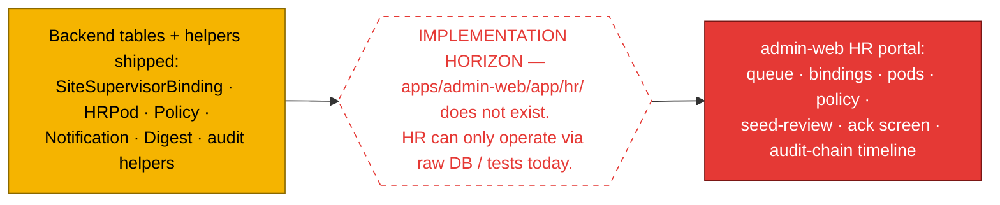
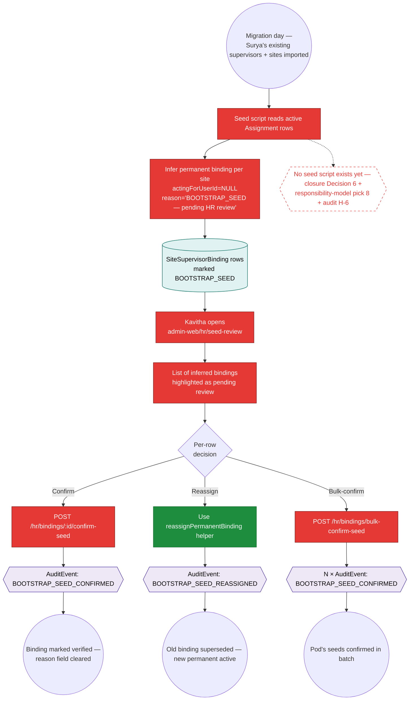
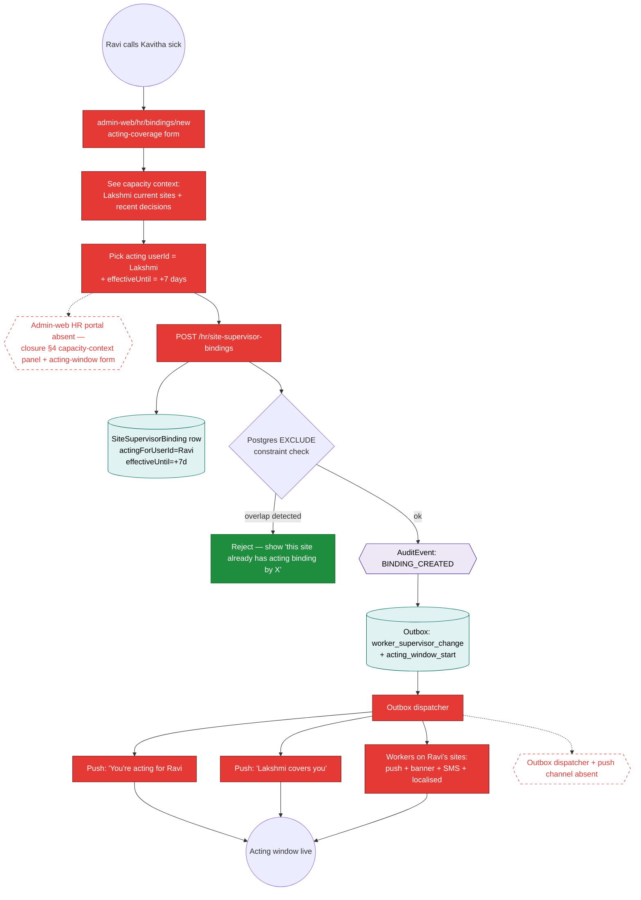
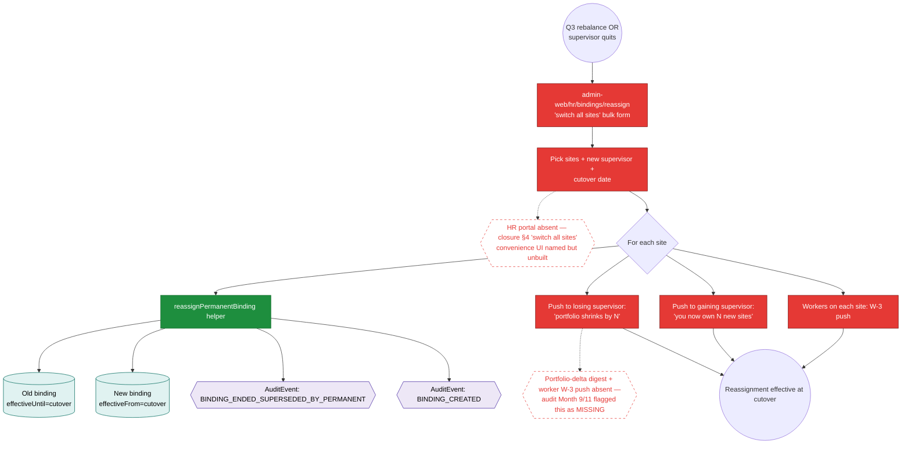

# Workflow Maps — HR (Kavitha)

> **Layer 2 — HR control-plane journey architecture.** Reads alongside `execution-state/hr-kavitha.md`. Most HR backend primitives are PARTIAL (table + helpers shipped) but the admin-web HR portal does not exist — `apps/admin-web/app/hr/` is missing. Diagrams show the intended flow plus where the absent portal is the implementation horizon.
>
> Spec lineage: closure spec §4 (HR pod model) + Decisions 1, 2, 3, 6 + responsibility-model §5.7; `axhy-v3/docs/audits/2026-05-15-1yr-sim-hr-kavitha.md` (H-1..H-9).

## Single horizon for the entire HR persona



---

## Journey 1 — Bootstrap seed review (H-6, pick 8)

The first thing Kavitha does at migration time. Per ops §8 + closure Decision 6.



---

## Journey 2 — Create acting cover (H-1, F26 orchestration)

Kavitha gets a call: Ravi is sick. She needs to bind Lakshmi as acting for Ravi's sites.



---

## Journey 3 — Permanent reassignment + portfolio liquidation (H-2 + H-4)

Q3 rebalance: Anjali takes 3 sites from Ravi. Or a supervisor quits and his portfolio liquidates.



---

## Journey 4 — EMPLOYMENT-tier final ack gate (H-7, D20 HR side)

Ravi proposes terminating a worker. Kavitha is the ack gate.

```mermaid
graph TD
    classDef built fill:#1e8e3e,stroke:#0b6624,color:#fff
    classDef partial fill:#f5b400,stroke:#8a6900,color:#000
    classDef notstarted fill:#e53935,stroke:#7a1715,color:#fff
    classDef table fill:#e0f2f1,stroke:#00695c,color:#000
    classDef event fill:#ede7f6,stroke:#4527a0,color:#000
    classDef horizon fill:#fff,stroke:#e53935,stroke-dasharray: 5 5,color:#e53935

    Start(("Ravi proposes terminate in chat"))
    Start --> Dwi[Write SupervisorDecision<br/>tier=EMPLOYMENT<br/>ackRequired=true<br/>+ originContext snapshot]:::notstarted
    Dwi --> DwiRow[(SupervisorDecision row<br/>+ originContext JSONB<br/>+ proposedDuringAbsence)]:::table

    H1{{DWI writer NOT_STARTED.<br/>Schema columns BUILT (P1.5).<br/>Chat emits WORKER_TERMINATION_REQUESTED AuditEvent only.}}:::horizon
    Dwi -.-> H1

    DwiRow --> Queue[Routes to HR pod queue]:::notstarted
    Queue --> AckScreen[admin-web/hr/ack/:id<br/>typed-phrase capture]:::notstarted
    AckScreen --> DecisionPanel[Decision-support panel:<br/>originContext + worker history +<br/>recent decisions]:::notstarted

    H2{{HR ack screen + decision-support panel absent}}:::horizon
    AckScreen -.-> H2

    DecisionPanel --> Type[Kavitha types exact phrase<br/>(per closure §5.3.9)]:::notstarted
    Type --> AckRoute[POST /decisions/:id/ack-employment]:::notstarted
    AckRoute --> Acked[(DWI ackedAt set)]:::table
    AckRoute --> AckEvt{{AuditEvent: TERMINATION_ACKED}}:::event

    Acked --> ApplyAfter[Auto-apply or queue for apply]:::notstarted
    ApplyAfter --> WorkerTerm[(Worker.state = TERMINATED)]:::table
    ApplyAfter --> AppliedEvt{{AuditEvent: TERMINATION_APPLIED}}:::event
    AppliedEvt --> ThreeAudience[3-audience push:<br/>originator + responsible + subject]:::notstarted

    ThreeAudience --> End1(("Termination effective"))
```

---

## Journey 5 — HR queue + leave approval (E21 HR side, SLA-tiered)

Closure Decision 3: 3 tiers + age-escalation.

```mermaid
graph TD
    classDef built fill:#1e8e3e,stroke:#0b6624,color:#fff
    classDef partial fill:#f5b400,stroke:#8a6900,color:#000
    classDef notstarted fill:#e53935,stroke:#7a1715,color:#fff
    classDef table fill:#e0f2f1,stroke:#00695c,color:#000
    classDef event fill:#ede7f6,stroke:#4527a0,color:#000
    classDef horizon fill:#fff,stroke:#e53935,stroke-dasharray: 5 5,color:#e53935

    Start(("Worker / supervisor creates<br/>LeaveRequest"))
    Start --> LRRow[(LeaveRequest row<br/>state=REQUESTED)]:::table
    LRRow --> QView[QueueItem view surfaces it]:::built

    QView --> Tier{Tier by Policy<br/>(closure Decision 3)}
    Tier -->|"URGENT 2h SLA"| Urgent[Top of queue]:::notstarted
    Tier -->|"NEXT_DAY 24h SLA"| NextDay[Mid queue]:::notstarted
    Tier -->|"STANDARD 7d"| Standard[Bottom]:::notstarted

    H1{{Tier classification logic + Policy reads absent —<br/>Policy table exists, classifier code does not}}:::horizon
    Tier -.-> H1

    Urgent --> Lock[Pessimistic lock acquired]:::notstarted
    Lock --> LockEvt{{AuditEvent: HR_QUEUE_LOCK_ACQUIRED}}:::event
    Lock --> KavithaUI[admin-web HR queue UI]:::notstarted

    KavithaUI --> Decide{Decide}
    Decide -->|"approve"| Approve[POST /leave-requests/:id/approve]:::built
    Decide -->|"reject"| Reject[POST /leave-requests/:id/reject]:::built
    Decide -->|"skip"| SkipUnlock[Release lock]:::notstarted

    Approve --> LREvt{{AuditEvent: LEAVE_APPROVED}}:::event
    Reject --> RejectEvt{{AuditEvent: LEAVE_REJECTED}}:::event

    LRRow --> AgeWatch{Age > SLA?}
    AgeWatch -->|"yes"| Escalate[Auto-escalate tier]:::notstarted
    Escalate --> EscEvt{{AuditEvent: HR_QUEUE_TIER_ESCALATED}}:::event

    H2{{Age-escalation cron not built (Stream F)}}:::horizon
    AgeWatch -.-> H2

    Approve --> End1(("Leave granted"))
    Reject --> End2(("Leave rejected with reason"))
```

---

## Journey 6 — HR-absent fallback (H-5, G-1, closure Decision 2)

What happens when Kavitha herself is on PTO for 3 days. Closure Decision 2: tiered fallback.

```mermaid
graph TD
    classDef built fill:#1e8e3e,stroke:#0b6624,color:#fff
    classDef notstarted fill:#e53935,stroke:#7a1715,color:#fff
    classDef table fill:#e0f2f1,stroke:#00695c,color:#000
    classDef event fill:#ede7f6,stroke:#4527a0,color:#000
    classDef horizon fill:#fff,stroke:#e53935,stroke-dasharray: 5 5,color:#e53935

    Start(("Kavitha takes 3-day PTO"))
    Start --> Queue[(HR queue items pile up)]:::table
    Queue --> AgeCheck[Per-item age timer ticks]:::notstarted

    AgeCheck --> Tier1{Age > 24h?}
    Tier1 -->|"yes"| InheritBackup[Backup pod owner inherits<br/>per HRPod.backupOwnerUserId]:::notstarted
    InheritBackup --> InheritEvt{{AuditEvent: HR_FALLBACK_INVOKED tier=1}}:::event
    InheritBackup --> NotifyBackup[Push to backup owner]:::notstarted

    AgeCheck --> Tier2{Age > 48h?}
    Tier2 -->|"yes"| CrossPod[Any HR user can override<br/>via cross-pod override flow]:::notstarted
    CrossPod --> CrossEvt{{AuditEvent: HR_CROSS_POD_OVERRIDE_USED tier=2}}:::event

    AgeCheck --> Tier3{Age > 72h?}
    Tier3 -->|"yes"| OwnerOverride[Owner emergency-override available<br/>(explicit invocation, NOT auto)]:::notstarted
    OwnerOverride --> OwnerNotify[Notify owner with severity]:::notstarted
    OwnerNotify --> OwnerInvoke[Owner explicitly invokes override]:::notstarted
    OwnerInvoke --> OverrideEvt{{AuditEvent: EMERGENCY_OVERRIDE_ACTIVATED tier=3}}:::event

    H1{{All three fallback tiers NOT_STARTED.<br/>HRPod columns exist (primaryOwnerUserId + backupOwnerUserId)<br/>but the age-tracking cron + escalation logic absent}}:::horizon
    Tier1 -.-> H1

    OverrideEvt --> End1(("Owner can take action on urgent items"))
```

---

## Spec lineage per journey

| Journey                              | Primary spec section                                  |
| ------------------------------------ | ----------------------------------------------------- |
| 1 — Bootstrap seed                   | responsibility-model §10 + pick 8; closure Decision 6 |
| 2 — Create acting                    | closure §4 + Decision 4; responsibility-model §5.7    |
| 3 — Permanent reassign + liquidation | closure §4; ops §8; P1.5 fix `44a453d`                |
| 4 — EMPLOYMENT ack                   | closure §5.3.9 + Decision 7; D.1 §2.5                 |
| 5 — HR queue + SLA                   | closure Decision 3                                    |
| 6 — HR-absent fallback               | closure Decision 2 (G-1)                              |
