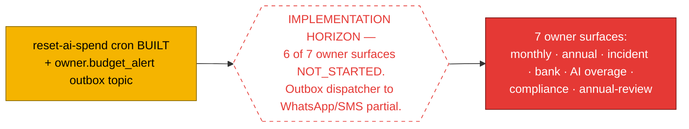
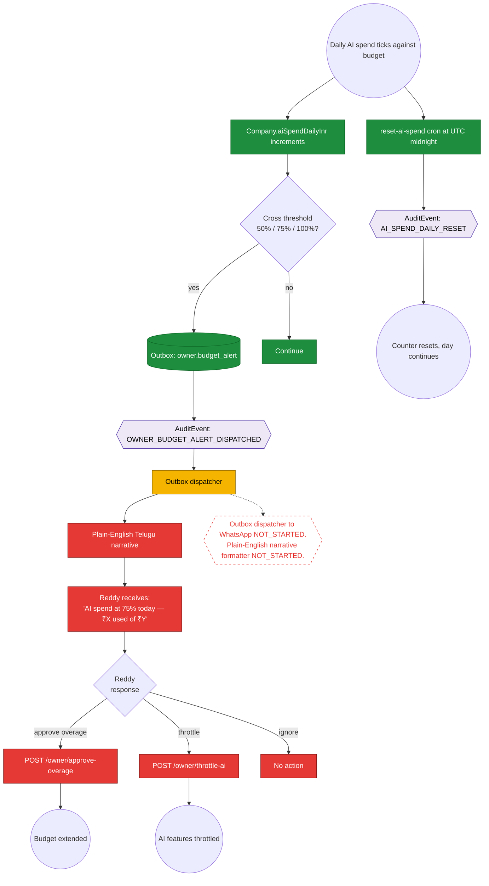
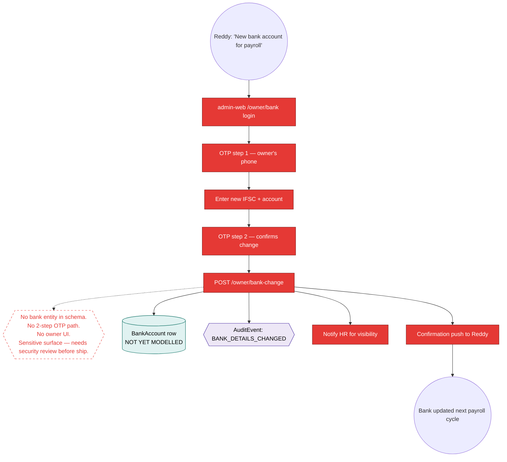
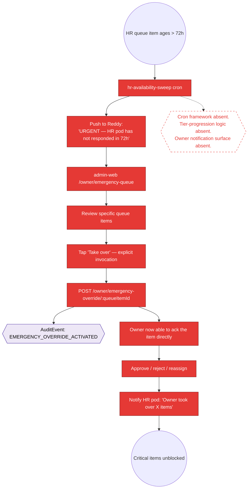

# Workflow Maps — Owner (Reddy)

> **Layer 2 — owner journey architecture.** Reads alongside `execution-state/owner-reddy.md`. Owner surfaces total 7 per closure Decision 10 (4 admin-web + 3 off-app). Today 1 of 7 has any code (`apps/admin-web/app/owner/page.tsx` stub) and 1 backend cron (`reset-ai-spend`).
>
> Spec lineage: closure spec §5.4 + Decision 2 (emergency override tier 3) + Decision 10 (7 owner surfaces); `axhy-v3/docs/audits/2026-05-15-1yr-sim-owner-reddy.md`.

## Single horizon for the entire owner persona



---

## Journey 1 — Monthly digest (O-1, closure Decision 10)

```mermaid
graph TD
    classDef built fill:#1e8e3e,stroke:#0b6624,color:#fff
    classDef partial fill:#f5b400,stroke:#8a6900,color:#000
    classDef notstarted fill:#e53935,stroke:#7a1715,color:#fff
    classDef table fill:#e0f2f1,stroke:#00695c,color:#000
    classDef event fill:#ede7f6,stroke:#4527a0,color:#000
    classDef horizon fill:#fff,stroke:#e53935,stroke-dasharray: 5 5,color:#e53935

    Start(("1st of month, UTC midnight cron"))
    Start --> Compose[DigestComposer.compose owner_monthly]:::notstarted
    Compose --> Collect[Aggregate Attendance + Complaints +<br/>Terminations + payroll totals across tenant]:::notstarted
    Collect --> Body[Build body JSON +<br/>plain-text Telugu+English rendering]:::notstarted
    Body --> DigestRow[(Digest row<br/>kind=owner_monthly<br/>bodyText set)]:::table

    H1{{DigestComposer service NOT_STARTED.<br/>Digest table schema BUILT (P1.5).}}:::horizon
    Compose -.-> H1

    DigestRow --> Outbox[(Outbox: owner_monthly_digest)]:::table
    Outbox --> Dispatcher[Outbox dispatcher]:::partial
    Dispatcher --> Channel{deliveryChannel}
    Channel -->|"whatsapp_out"| WA[WhatsApp summary +<br/>admin-web detail link]:::notstarted
    Channel -->|"email"| Email[Email PDF attachment]:::notstarted

    H2{{WhatsApp/SMS adapter NOT_STARTED.<br/>MSG91 webhook deferred per launch checklist.}}:::horizon
    WA -.-> H2

    WA --> ReddyPhone[Reddy reads on phone]:::notstarted
    ReddyPhone --> TapDetail[Tap → admin-web/owner/digests/:id]:::notstarted
    TapDetail --> DetailUI[Detail page with KPIs + drill-down]:::notstarted
    DetailUI --> End1(("Reddy has month-end snapshot"))
```

---

## Journey 2 — AI budget alert (G29, the only PARTIAL surface today)



---

## Journey 3 — Bank-authority change (O-4, 2-step OTP, sensitive)

Reddy needs to update Surya's payroll bank account. Per closure Decision 10.



---

## Journey 4 — Emergency override (closure Decision 2 tier 3)

The most consequential owner surface. HR is fully absent for 72h; system escalates to Reddy.



**Explicit invocation rule (closure Decision 2):** owner does NOT auto-inherit. Push notifies owner; owner must tap to take over. Prevents silent ownership transfer.

---

## Spec lineage per journey

| Journey                   | Primary spec section                       |
| ------------------------- | ------------------------------------------ |
| 1 — Monthly digest        | closure Decision 10; Digest schema (P1.5)  |
| 2 — AI budget alert       | data-flow §9; reset-ai-spend cron commit   |
| 3 — Bank-authority change | closure Decision 10 (bank UI + 2-step OTP) |
| 4 — Emergency override    | closure Decision 2 tier 3                  |
