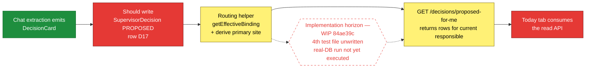
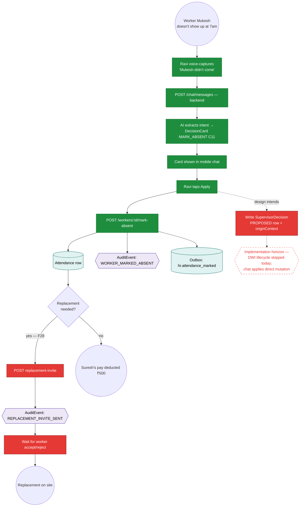
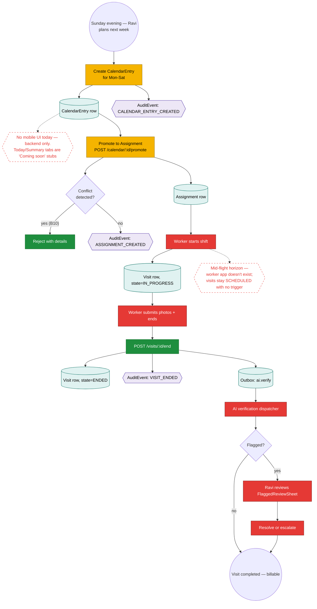
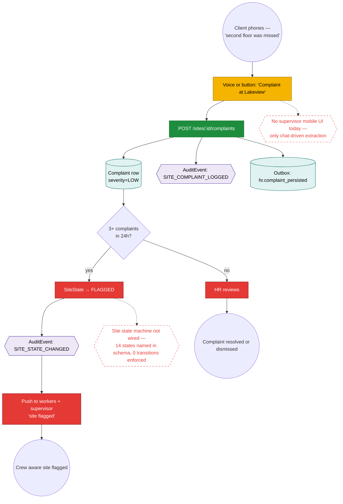
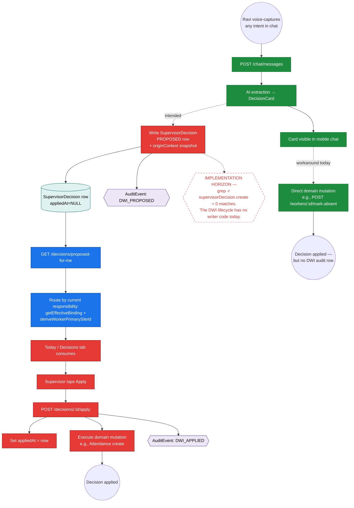
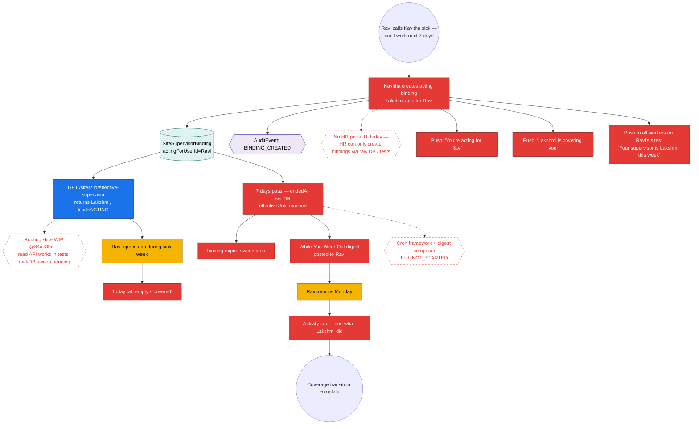
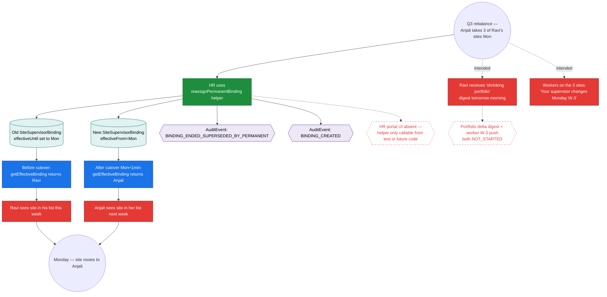

# Workflow Maps — Supervisor (Ravi)

> **Layer 2 — workflow architecture.** Reads alongside `execution-state/supervisor-ravi.md` (which is the build-state tracker). This file is the _journey_ layer: how each workflow is intended to run end-to-end from Ravi's seat, what entities are touched, where the implementation horizon is.
>
> Spec lineage:
>
> - `axhy-v3/docs/specs/2026-05-14-supervisor-responsibility-model.md` §§5–7
> - `axhy-v3/docs/specs/2026-05-15-workflow-design-closure.md` §§3–9
> - `axhy-v3/docs/specs/2026-05-12-supervisor-mobile-r6-design.md` (R6)
> - `axhy-v3/docs/audits/2026-05-14-1yr-sim-supervisor-ravi.md`

## Current-slice focus

The diagram below shows ONLY the path the active routing slice touches. Updated at start, pause/block, and after verify+commit (failure-mode rule 8).



**State of current slice:** routing slice paused at WIP commit `84ae39c`. Helpers + 2 routes + 3 of 4 tests written. Real-DB sweep not yet run. The blocking step is the test file `apps/backend/test/effective-responsibility-point-in-time.test.ts`.

---

## Journey 1 — Worker no-show → mark absent → maybe replacement

The most-common daily flow. Ravi gets a phone call from Suresh-the-supervisor-of-record, or notices on the chat. Spec: data-flow §5; ops-workflow-model A.C11 + F28.



**What's intended but missing:**

- DWI lifecycle path (D17 row): the chat applies the mutation directly today, skipping PROPOSED → APPLIED. Every audit + analytics use case behind that lifecycle is gone.
- Replacement invite (F28): no backend route, no UI, no worker-side response surface.

**What's load-bearing today:** Attendance row + AuditEvent. Pay-deduct math works. The 1-of-3 surfaces that's fully `END_TO_END` for daily ops.

---

## Journey 2 — Daily scheduling (calendar → assignment → visit)

Ravi's recurring weekly rhythm. Spec: ops-workflow-model B.B7–B10 + C.C12; R6 §4.



**What's intended but missing:** worker mobile app blocks the entire middle. Backend handles the start + end transitions, but no human can trigger them from Suresh's side today. AI verification dispatcher is Phase C.

---

## Journey 3 — Site complaint

Ravi logs a complaint about a site (client called, area unclean, equipment missing). Spec: data-flow §5; ops-workflow-model C13.



**What's intended but missing:** SiteState machine is a placeholder string today. The cascade to FLAGGED + worker push is closure Decision 5 unbuilt.

---

## Journey 4 — Chat → DWI lifecycle (the missing-middle)

The headline gap. Closure spec mandates a PROPOSED-row intermediate for every supervisor-initiated decision. Chat MVP currently skips it.



**Why this matters:** every cross-cutting feature (acting cover routing, EMPLOYMENT-tier HR ack, decision-dismiss, undo) rides on the DWI lifecycle existing. Without it, those features have no rows to read.

**Current slice (routing) does the read side.** The writer side is a separate slice.

---

## Journey 5 — Ravi gets sick → Lakshmi covers (F26 from Ravi's seat)

The headline P1.5 workflow. Spec: responsibility-model §5–7; closure Decision 4.



**What's built:** the binding table + EXCLUDE invariant + audit-emit helpers + reassignPermanentBinding service helper + the routing read API (WIP @84ae39c).

**Five surfaces gating end-to-end:** (1) HR portal create-binding form, (2) Lakshmi push, (3) Ravi push, (4) worker push (W-1), (5) while-you-were-out digest. None built.

---

## Journey 6 — Ravi hands sites to Anjali (F27 future-dated handoff from Ravi's seat)

Future-dated permanent reassignment. The P1.5 fix made this work mechanically. Spec: responsibility-model §7 + §9; closure §4.



**What's built:** the mechanism (binding rows + audit events + future-dated cutover via effectiveUntil — the P1.5 fix 44a453d).

**What's not:** HR portal write surface, supervisor portfolio-delta digest (audit Month 9/11 named this as MISSING), worker W-3 push.

---

## Spec lineage per journey

| Journey                       | Primary spec section                                                |
| ----------------------------- | ------------------------------------------------------------------- |
| 1 — Mark absent + replacement | ops-workflow-model §6 (C11, F28); data-flow §5                      |
| 2 — Daily scheduling          | R6 §4; ops §6 (B7–B10, C12); state-machines visit.ts                |
| 3 — Site complaint            | data-flow §5; ops §6 (C13); closure Decision 5 (site state cascade) |
| 4 — Chat → DWI lifecycle      | D.1 §2; closure Decision 7 (originContext); ops §6 (D16–D20)        |
| 5 — F26 sick coverage         | responsibility-model §5–7; closure Decision 4                       |
| 6 — F27 future-dated reassign | responsibility-model §7+§9; closure §4; P1.5 fix commit `44a453d`   |

## Recent commits affecting Ravi's journeys

```
d4bb4c8 docs(handoff): execution-state tracker (journey 4, 5, 6 build-state)
84ae39c wip(routing): foundation read APIs (journey 4 read side, journeys 5+6 lookup)
44a453d fix(binding): permanent reassignment uses effectiveUntil (journey 6 fix)
fe0f6f4 test(binding): SiteSupervisorBinding real-DB lifecycle tests (journeys 5+6)
a8eed8b feat(audit): BINDING_* audit helpers (journeys 5+6)
9c0b3d8 feat(schema): SiteSupervisorBinding table (journeys 5+6)
```
