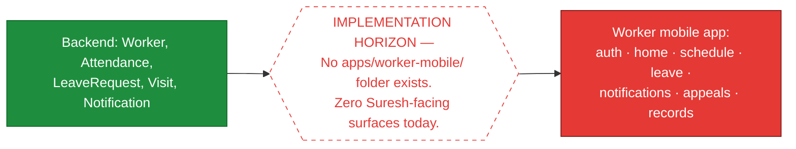
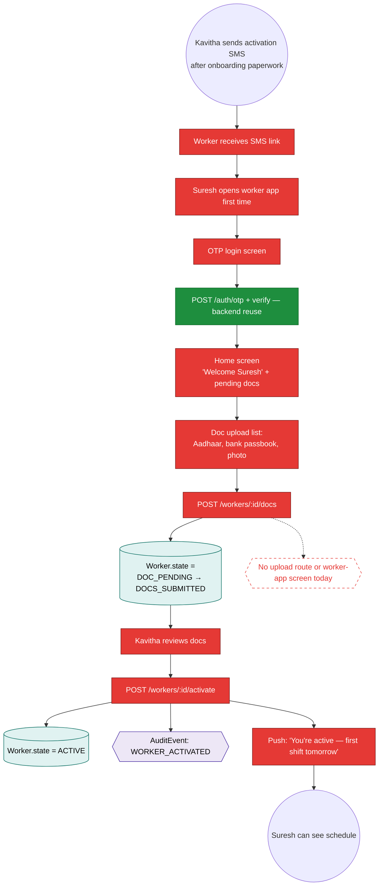
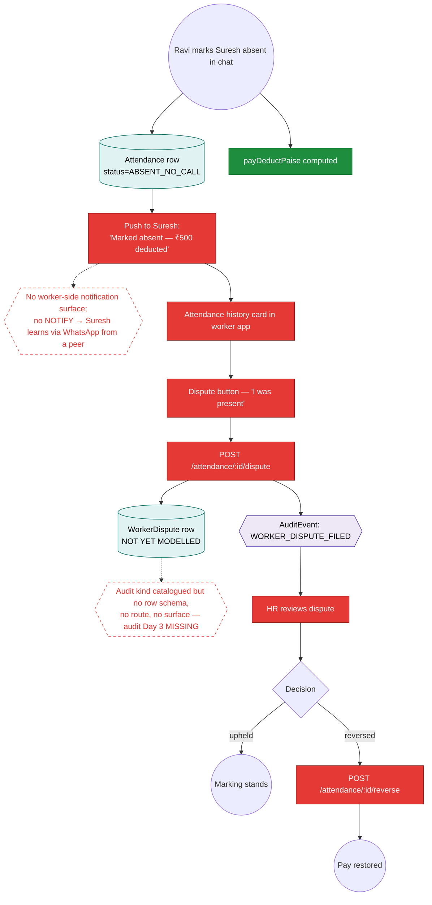
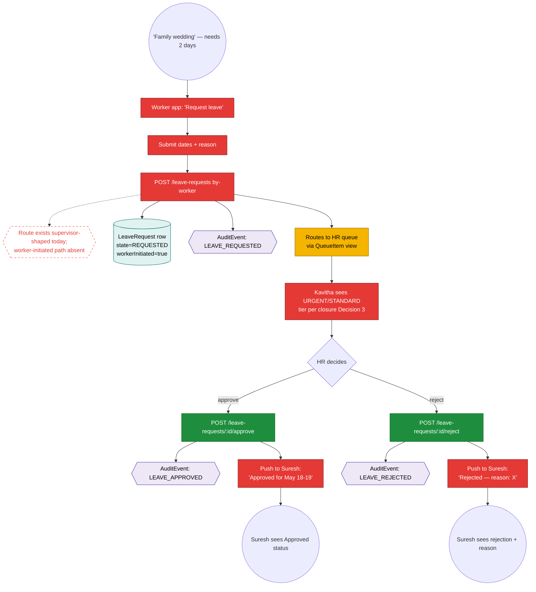
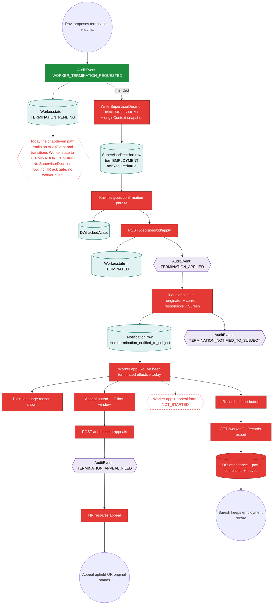

# Workflow Maps — Worker (Suresh)

> **Layer 2 — workflow architecture from Suresh's seat.** Reads alongside `execution-state/worker-suresh.md`. **Every journey here is `NOT_STARTED` from Suresh's perspective today** because the worker mobile app folder does not exist (`apps/worker-mobile/` is missing). The diagrams document the INTENDED flow so the worker-app slice, when it lands, has a target.
>
> Spec lineage: closure spec §5 (worker surface) + Decision 4 (W-1/W-2/W-3/W-7 notifications) + Decision 5 (termination notification + appeal); `axhy-v3/docs/audits/2026-05-14-1yr-sim-worker-suresh.md`.

## Single horizon for this entire persona



Until this horizon moves, all 5 journeys below are aspirational.

---

## Journey 1 — First activation (A3 + A4)

How Suresh experiences day 1 when the worker app exists.



---

## Journey 2 — Marked absent (C11 subject view)

Suresh wakes up sick; supervisor marks him absent; Suresh wants to know what happened.



---

## Journey 3 — Suresh requests leave (E21 worker-initiated)

He has a family wedding, wants 2 days off.



---

## Journey 4 — Supervisor change notification (W-1 + W-2 + W-3 + W-7)

The headline Suresh case. Closure Decision 4 mandates this; nothing exists today.

```mermaid
graph TD
    classDef built fill:#1e8e3e,stroke:#0b6624,color:#fff
    classDef notstarted fill:#e53935,stroke:#7a1715,color:#fff
    classDef table fill:#e0f2f1,stroke:#00695c,color:#000
    classDef event fill:#ede7f6,stroke:#4527a0,color:#000
    classDef horizon fill:#fff,stroke:#e53935,stroke-dasharray: 5 5,color:#e53935

    Start(("HR creates acting binding<br/>OR permanent reassignment for Suresh's site"))
    Start --> Binding[(SiteSupervisorBinding row inserted<br/>or effectiveUntil updated)]:::table
    Start --> BindEvt{{AuditEvent: BINDING_CREATED<br/>or BINDING_ENDED_SUPERSEDED_BY_PERMANENT}}:::event

    BindEvt --> Trigger[Notification emitter<br/>worker-supervisor-change]:::notstarted
    Trigger --> Notif[(Notification row<br/>audienceWorkerId=Suresh<br/>kind=supervisor_change)]:::table

    H1{{Closure Decision 4 mandates this whole branch.<br/>Zero notification emitters wired for binding lifecycle.<br/>AuditEvent kind WORKER_SUPERVISOR_CHANGE_NOTIFIED catalogued, no emitter.}}:::horizon
    Trigger -.-> H1

    Trigger --> Dispatch[Outbox dispatcher → channels]:::notstarted
    Dispatch --> Push[Push: 'Your supervisor is now Lakshmi (acting for Ravi until May 22)']:::notstarted
    Dispatch --> Banner[In-app banner on worker home]:::notstarted
    Dispatch --> SMSFallback[SMS fallback if push fails]:::notstarted

    Push --> Localised{Suresh's<br/>preferredLanguage}
    Localised -->|"hi"| HiText[Hindi text content]:::notstarted
    Localised -->|"en"| EnText[English text content]:::notstarted
    Localised -->|"te/bn/ta"| OtherLang[Other locale per Worker.preferredLanguage column]:::notstarted

    HiText --> End1(("Suresh knows who to call this week"))
    EnText --> End1
    OtherLang --> End1
```

**Note:** `Worker.preferredLanguage` column shipped in P1.5 (commit `095c766`) with `'hi'` default per closure §5.1. The column exists — the emitter doesn't.

---

## Journey 5 — Suresh is terminated (E24 / W-4 subject view)

The most consequential moment for Suresh. Closure Decision 5: in-app push + 7-day appeal + records export.



**Audit verdict:** `BROKEN` design today — the worker's most consequential moment is fully offline (no app, no push, no appeal). The fix is closure Decision 5 implementation in full.

---

## Spec lineage per journey

| Journey                            | Primary spec section                                           |
| ---------------------------------- | -------------------------------------------------------------- |
| 1 — First activation               | ops-workflow-model A3+A4; state-machines worker.ts             |
| 2 — Marked absent subject view     | ops §6 C11; audit Day 3 MISSING                                |
| 3 — Worker leave init              | ops §6 E21; closure Decision 3 (SLA tiers)                     |
| 4 — Supervisor change notification | closure Decision 4 (mandatory push + banner + SMS + localised) |
| 5 — Termination subject            | closure Decision 5 (in-app + 7-day appeal + records export)    |
